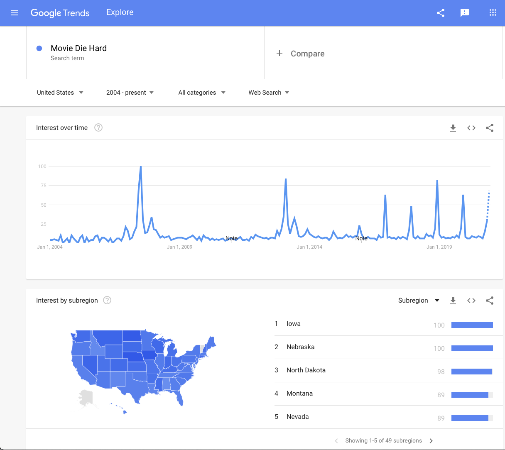

# What is Data?

Information that is presented as "Evidence" for or against something can come
in many different levels of rigor and applicability. In this chapter, we'll
discuss and categorize different data types.

## Attributes of Reliable Data
There are several attributes of insightful data.

### Collected in "good faith"
During the 2020 election, I received many "survey's"
from both the Republican and Democratic parties. These are not actually intended
to measure people's opinions, but are thinly disguised solicitations for money.
The questions were inevitably presented in a way to deliberately upset the
audience in order to solicit a campaign contribution. Examples of 
Republican/Democratic "survey's" 
    a)  Given the greenhouse effects potential to cause widespread damage, including 
        increased severity of hurricanes, increases in flooding, and drought, do 
        you support legislature to reduce CO2 emissions?
    b)  Do you want to defend your 2nd amendment right to protect your family.

The questions, and indeed the entire survey, was built in a way to bias the 
results in one way or another.

It is tempting to assume that *experts* will always engage in research 
*with a good faith* effort to find the truth. Unfortunately a degree doesn't
guarantee a person is actually an expert, or that they are impervious to 
personal gain.

The scientific peer-review process is an arduous process by which other respected
researchers in the field examine the work and point out flaws in methodology and
interpretation. Many of the journal articles I've written have been vastly improved
by the peer-review process and issues with methodology were appropriately adjusted.
Conversely, as a reviewer, I've worked hard to verify the design and analysis and
provide useful feedback to improve the research or suggest how to improve the 
study in subsequent work, even when recommending against publishing an article.

However, peer-review is not a guarantee that data is of high quality and there
is nothing suspect. 

**Examples**

Many examples can be found on Wikipedia's page on 
[Scientific Misconduct](https://en.wikipedia.org/wiki/List_of_scientific_misconduct_incidents)
and most of those involve fabrication of data.

* In 1998, Dr. Andrew Wakefield published a study in the well-respected journal
*The Lancet* on $n=12$ children looking
for adverse reactions to the MMR vaccine and concluded there was an association
with gastointestinal disorders and developmental regression (aka autism). It turns
out Dr Wakefield's research was funded by lawyers that were sueing vaccine 
manufacturers. Ultimately *The Lancet* retracted the paper and Britian's 
General Medical Council found that Wakefield had acted unethically.


### Representative
The data we use to address a question should be representative of the population
we care about. For example, if we care about the effect of the Covid-19 pandemic
on employment. If we only used data from one state, say New York which was the
initial hot spot of the pandemic in the US, that would not
be indicative of rates in rural which were hit much much later.

In Phase III trials for the Covid-19 vaccines and treatments where criticized
for not having enough diversity in the patients enrolled in the trial. The 
trials did not include a proportional amount of Black, Hispanic, and Native Americans.
This is a problem because there could be genetic factors that cause the medicine
to be less effective, or have more side-effects for one of these 
[groups](https://www.biospace.com/article/study-points-to-lack-of-diversity-in-covid-19-clinical-trial/).

Initial approval for the Pfizer vaccine was approved for people older than 16 because
the Phase III trials did not include children. Similarly, the vaccine was not approved
for pregnant women for similar reasons.

<!-- When the data are NOT representative and an important sub-group is not included, -->
<!-- then we say that the data is *biased*. A good example of this political polls where -->
<!-- conservatives are less likely to respond to random phone surveys than liberals and -->
<!-- led to election forecasters incorrectly predicting the outcome of the 2016 US  -->
<!-- presidential election. -->

### Sufficient
Often we are required to think through problems using data and statistics that
seem to be useful, but not perfectly aligned with the question of interest. 


**Example** Bureau of Labor Statistics - Unemployment Rate 
The unemployment rate is defined as the percentage of unemployed workers in the 
total labor force. Workers are considered unemployed if they currently do not 
work, despite the fact that they are able and willing to do so. The total labor 
force consists of all employed and unemployed people within an economy.

But this definition misses people that were previously employed but now not working
and not looking for work. For example, during the Covid-19 pandemic, many people
were not working, and not looking for work because there were no public service
jobs. As a result they were missed in unemployment rate. Furthermore,
the women were more likely to be missed because they were more likely to stay
home with children that were also at home doing school online.

**Example** Bureau of Labor Statistics - Average wages
Another example of a statistic that seems useful is the average wages. The initially
surprising statistic is that the average wages *increased* during the 
[pandemic](https://industrytoday.com/average-wages-during-the-coronavirus-pandemic/).
This should NOT be considered evidence that the economic fall-out of the pandemic
wasn't too bad. The reason that we saw the average wages increase is because the
majority of jobs lost during the pandemic were low-wage service industry jobs. 
High income workers that could more easily switch to remote work were much less
impacted.

The key issue in both of these issues is that there is more to the story and
the statistic that we are focused on only one aspect of the problem. The problem
is that this aspect is not sufficient information to really understand the issue.

Unfortunately, if the audience doesn't know enough about the statistics used, 
it can be easy to draw the wrong conclusion. 


## Categories of Data Quality  
    
Data can be broken down into three broad types: anecdotal & deceptive evidence, ad-hoc 
information, and purposefully collected data. 


### Anecdotes & Deceptive Evidence
This lowest tier of data should be regarded with a great deal of skepticism. The
primary issues with this class of data is that there is no attempt at the data
being representative of a pertinent group and there is no attempt to avoid bias.

Anecdotes are stories presented outlining one person's experience. As a species,
humans have always passed stories from one generation to the next by passing 
anecdotes. In fact, we probably haven't seen experimental evidence for a lot
of what we take as truth. As a result, anecdotes can often be quite compelling 
and are often utilized in disinformation campaigns.

People often have a difficult time assessing risk because news stories report
about unusual events, not everyday events. For example, a single death by a
[shark attack](https://www.oregonlive.com/nation/2020/12/surfer-off-maui-dies-after-shark-bite-unusual-rare-shark-attack-also-kills-tourist-in-caribbean.html)
is news, but the 600,000 US citizens that will die by 
[cancer](https://www.cancer.gov/about-cancer/understanding/statistics)
does not. As a result, many people worry about newsworthy events with a small 
probability of happening while ignoring much more substantial risks. 

[Anecdotes](https://www.npr.org/2019/05/09/721773510/facts-arent-enough-the-psychology-of-false-beliefs) 
about the link between autism and vaccines have been particularly compelling for
new parents as they learn about how to raise an infant. The "social trust" gained
by dispensing insights into diapers, swaddling, and feeding carries over into
medical issues about vaccination. Furthermore parents sharing anecdotes about how
they wished they can vaccinated their children are 
[harassed and intimidated](https://www.npr.org/2020/02/11/804882997/vaccines-misinformation-and-the-internet-part-1).

Vaccination anecdotes display issues with all three attributes of data quality:

* They are collected with an agenda. The on-line anti-vaccination community
    actively promotes stories of children who appear to suddenly become autistic
    while harassing and intimidating opposing stories.
* The stories are not representative because we don't hear about the millions
    of parents who vaccinated their children and observed no discernible change
    in behavior.
* The stories are not sufficient because they can't account for the issue that
    autism is not generally diagnosed until a baby starts missing social milestones,
    which occur *after* the baby has had several rounds of vaccines.

Unfortunately information shown in advertisements can often be in this tier of
evidence. The classic example from the 1970s is "4 out of 5 dentists recommend chewing 
Trident Sugar-Free gum" but the fine print mentions that it was recommended 
compared to chewing regular sugar gum. A modern take on this is the phrase
"Scientifically proven to ...". For example, a 
[2014 ad campaign](https://www.youtube.com/watch?v=ON_WkSWgSwU) 
for Listerine used the phrase 

> "... is clinically proven to treat gum disease and healthier gums in as little as 2 weeks." 

but provides no information about what the comparison
group was and, most critically, does not provide information about the extent
to which the gum disease was treated. Without this information, it the clinical
data could have been biased by comparing against NO dental care group, or the 
effect could have been positive, but practically insignificant. In either case
the statement would be true, but also highly misleading.


### Ad-Hoc Data
Ad-hoc information is collected in a systematic way, but not in a way to specifically
address a particular questions. This is often much better than anecdotal evidence,
as there isn't purposefully designed bias in the data and generally is representative
of some population, but it isn't necessarily exactly the population we might want.
Often confounding issues often are serious.

Ad-hoc data is typically representative of *some population*
but isn't necessarily sufficient information to address question in an actionable 
way. Ad-hoc data and statistics tend to be interesting, but lead the reader to
wonder "Why is that?"

**Example** The question "Is Die Hard a Christmas Movie?" is a perennial pointless
discussion on the internet but we can look at Google's search trends and see that 
there is a consistent peak in 
[December](https://trends.google.com/trends/explore?date=all&geo=US&q=Movie%20Die%20Hard).



The engineers at Google that are collecting this information aren't deliberately
trying to sway the result one way or the other, and is based on ALL all Google 
searches, so it is certainly representative of Google users, but that is not the 
same as all people, nor even all US people. It isn't 
clear that this is actually a reasonable argument because maybe people are just
Googling because people keep asking this question. So perhaps Die Hard isn't a 
Christmas Movie, but "Is Die Hard a Christmas Movie?" is a Christmas question.


**Example** Road Fatalities by State.
As per the IIHS and HLDI [website](https://www.iihs.org)

> The Insurance Institute for Highway Safety (IIHS) is an independent, nonprofit 
> scientific and educational organization dedicated to reducing the losses — deaths, 
> injuries and property damage — from motor vehicle crashes. The Highway Loss Data 
> Institute (HLDI) shares and supports this mission through scientific studies of 
> insurance data representing the human and economic losses resulting from the ownership 
> and operation of different types of vehicles and by publishing insurance loss results 
> by vehicle make and model.

They have 
[data](https://www.iihs.org/topics/fatality-statistics/detail/state-by-state)
for the 2018 traffic fatality death rates by state which can be used to produce the
following chloropleth (geographic map colored by rate)

```{r, cache=TRUE, echo=FALSE, warning=FALSE, message=FALSE}
suppressPackageStartupMessages({
  library(tidyverse)   # loading ggplot2 and dplyr
  library(rvest)
  library(fiftystater)
})
page <- read_html('https://www.iihs.org/topics/fatality-statistics/detail/state-by-state')

State_Fatality_Rates <- 
  page %>%
  html_nodes('table') %>% 
  .[[1]] %>%                              # Grab the first table and 
  html_table(header=FALSE, fill=TRUE) %>% # convert it from HTML into a data.frame 
  setNames( .[2,] ) %>%
  slice( c(-1,-2) ) %>%
  mutate(across(2:7, parse_number)) %>%
  rename(state=State) %>%
  mutate( state = str_to_lower(state) )


ggplot(State_Fatality_Rates, aes(map_id = state)) + 
  # map points to the fifty_states shape data
  geom_map(aes(fill = `Deaths per 100,000 population`), 
           map = fifty_states) + 
  expand_limits(x = fifty_states$long, y = fifty_states$lat) +
  coord_map() +
  scale_x_continuous(breaks = NULL) + 
  scale_y_continuous(breaks = NULL) +
  scale_fill_gradient(high='red') +
  labs(x = "", y = "", title='2018 Traffic Fatalities per 100,000 Residents') +
  theme(legend.position = "bottom", 
        panel.background = element_blank())

```

In general it looks like the fatality rate is higher in rural states compared to
more urban states, but that doesn't explain why Utah and Minnesota's relatively 
low death rate. This sort of data leads to speculation regarding state liquor laws,
the average length of commute, and a host of other possible explanations.

Unfortunately we don't have information about these other explanations. 

|  Covariate Type    |    Interpretation    |
|:------------------:|:------------------------------------|
| Response           | This is the variable in the data that we want to explain or understand. If there is a cause/effect relationship, this is the variable that is effected by the explanatory variable. |
| Explanatory        | This are the variables our data that help us understand the response variable. In a cause/effect relationship, this is the causal variable.|
| Confounding        | These are variables that are quite important and perhaps are the actual cause of the response that you are interested in, but we don't have or can't use in the model for technical reasons. That is, we are unable to account for this effect, even though we *know* it is an issue. Ideally subsequent studies would take this into account and design the data collection process so that in subsequent data sets, the variable becomes an explanatory variable. |
| Lurking            | These are variables that play a role in the response, but experts in the field don't even know that these are an issue. As research in a scientific field grows, more *Lurking* variables become known and become confounding variables. |

As an example, suppose that we have a data set of middle aged men and we have 
information about the individuals history of cholesterol levels and if they have 
experienced heart disease. 
Because we believe that high cholesterol levels
are a primary cause of heart disease then the explanatory variable is the cholesterol
level and the response variable is the heart disease risk. 
Suppose we don't have any other information, but acknowledge that there
are other factors that influence the risk of heart disease such as having diabetes
and smoking status. Those variables (which we don't have access to) would be
considered confounding variables. We know that there is some generic component
to heart disease, but we haven't yet fully identified particular gene
variants. These genetic variables that don't understand would lurking variables.

In 2002, then Secretary of Defense Donald Rumsfeld gave a somewhat confusing 
statement:

> Reports that say that something hasn't happened are always interesting to me, 
> because as we know, there are known knowns; there are things we know we know. 
> We also know there are known unknowns; that is to say we know there are some 
> things we do not know. But there are also unknown unknowns—the ones we don't 
> know we don't know. And if one looks throughout the history of our country and 
> other free countries, it is the latter category that tends to be the difficult ones.

Secretary Rumsfeld was effectively talking about the difference between 
explanatory (known knowns), confounding (known unknowns), and 
lurking (unknown unknowns) variables.

Because ad-hoc data was not collected with a particular purpose in mind, it tends
to have substantial issues with confounding and lurking variables.


### Purposefully Designed Studies

These studies are well thought out to address a particular question. Effort has
been taken to consider what an appropriate response variable would be and what
explanatory variables make the most sense given the research. Possible confounding
variables will be considered and every attempt will be made to gather the information
in a way that those variables can be incorporated into the study. The primary 
difference between the two study we'll explore in this section is if lurking 
variables are addressed.


#### Observational Studies

Observational studies are purposefully designed and could incorporate multiple
ad-hoc data sets but the data is intended to address as many known confounding 
variables as possible, but unfortunately not all confounding variables can
be addressed. 

The strength of observational studies is that they are much cheaper to do compared
to experiments and so extremely large sample-sizes are possible. This can increase
the representativeness of the data and make it possible to detect small effects.

**Example** The use of Hormone Replacement Therapy (HRT) for post-menapausal 
women has a 
[long history](https://www.ncbi.nlm.nih.gov/pmc/articles/PMC6780820/).
The short version is that using prescribing estrogen (later combined with 
progesterone) alleviated many symptoms associated with menopause and had some
positive preventative effects on other chronic diseases. 
The evidence that HRT had a positive preventative effect on was based on observational
studies that showed that women that had taken HRT had lower rates of certain
types of cancer, osteoporosis, and dementia. 

However, because these were observational, researchers had to rely on large
groups of woman that, for one reason or another, either did or did not have HRT.
Aspects such as socio-economic status and geographical location affect who 
received HRT. Unfortunately these aspects also are related to overall health as
lower-income women typically have worse health outcomes in general (possible reasons
include more pollution/carcinogen exposure, increased sustained stress levels,
and reduced access to routine medical screening. 

As a result, the women's socio-economic status was a confounding variable that
the large-scale observational studies couldn't address because the HRT vs non-HRT
groups were unbalanced with more generally healthy women taking HRT.

Small scale observational studies with 
roughly similar populations of women in both the HRT and non-HRT groups showed 
some indications that taking HRT might actually increase rates of cancer, but 
the variability associated with the small sample sizes made the results unclear.

#### Experiments

Experiments are purposefully designed studies and can be designed to address
both confounding and lurking variables. Typically experiments involve substantially
fewer subjects that observation studies, but researchers are able to 
randomly assign subjects to a treatment. This manipulation is critical because, for 
any confounding variable, we can force an equal number of treatment vs control
subjects. After breaking the subjects into groups according to the known 
confounding variables, the subjects are then randomly assigned to a treatment 
group. The random assignment forces any lurking variable groups to *also* be
evenly distributed between the treatment groups!

In 1998, the Women's Health Initiative (WHI) started and was a massive 
($n=16,608$) randomized experiment to test the effects of HRT for women aged 50-79 
on a variety of health outcomes, including breast cancer. 
The results were compelling and the experiment ended after 5 years, instead of the 
planned 8 years. 
[Data](https://jamanetwork.com/journals/jama/fullarticle/195120) 
showed increased rates of heart disease and breast cancer.

However, there was still much to criticize about the study, particularly that
the women were 10+ years post-menopause. Further studies have been conducted
to refine our understanding and look at short-term use of HRT.


## Examples

### A Washingtion Post / ABC News Survey
On Jan 19, 2021, 
[The Washington Post](https://www.washingtonpost.com/health/covid-poll-pandemic-out-of-control/2021/01/18/e4986a06-598f-11eb-8bcf-3877871c819d_story.html) 
ran a story about a survey they had done
the week before addressing if US Adults thought that the coronavirus pandemic was
under control.

There are several questions to ask

1.  *Are the pollsters well regarded and can we assume they are acting "in good faith?"* 
    In this case, we could consider how accurately this polling organization has been
    in past elections and see if there is a consistent partisan slant. The folks that
    run [fivethirtyeight.com](https://fivethirtyeight.com) actually keep track of this
    and the Post has an 
    [A+](https://projects.fivethirtyeight.com/pollster-ratings/)
    rating from them. The Washington Post Polling is widely considered highly reputable 
    polling organization and act "in good faith."
    
2.  *Is the data representative?* Polls like this are typically done via random digit
    dialing which attempts to contact people via phone. While some people refuse to
    talk to polling firms, many people do. According to an 
    [2019 article](https://www.washingtonpost.com/politics/2019/01/18/faq-why-you-can-be-largely-confident-public-political-polling/)
    by the Post, their polls do try to capture a representative group of US adults
    by making sure (or mathematically correcting for) differences in gender, 
    geographic region, age group, and political affiliation. This approach is decent
    but it isn't perfect; for example people without phones or will not answer them
    are not represented. Ultimately the data is decently representative, but the 
    non-response issue might slightly throw off the results, perhaps by a percent or two.
    For this poll, that probably isn't a big deal, but for election forecasts, that
    might be a *huge* deal such as in the 2016 US Presidential election.
    
3.  *Is the data sufficient?* Given that the survey directly asked the question we are
    interested in, it is certainly sufficient.
    
Because this has no experimental manipulation (i.e. we didn't assign respondents to be
a part of a political part or gender or some other silliness) this is an observational
study and qualifies as a purposefully designed study.

## Exercises
1.  For the following variables, identify the response variable and the
    explanatory/confounding variable. If the variable is confounding, speculate 
    on the variable that would better predict the response variable.
    a)  Height and reading proficiency score of children.
    b)  Heart disease rates and obesity levels measured via Body Mass Index (BMI). 
        *Hint: Dwayne "The Rock" Johnson is technically obese.*
    c)  Attendance in classroom lectures and overall score in the course.

2.  Researchers trying to create robust facial recognition software have struggled
    to get large data sets of faces. The ultimate goal is to be able to identify
    an individual in a variety lighting situations and angles. For each of the 
    data sets below, identify issues related to bias, representativeness,
    and sufficiency for training facial recognition software for detecting individuals
    with arrest warrants outstanding from public video feeds (for example at an airport
    or subway).
    a)  The website 'LinkedIn' is intended to be a professional social network where
        users are encouraged to upload a facial profile picture of themselves. The
        individuals are typically looking for a job and companies pay for access
        to efficiently search through individuals. Scraping these images creates 
        a data set of well-lit, generally front facing faces.
    b)  The Apple operating system has a photo application which allows users
        to tag individuals in photos. With this feature turned on, the software
        makes a guess as to who a person is and the user can chose to change and
        correct the tag. Facebook offers a similar tagging feature. At this point
        images from Flickr and Instagram are part of a large data set intended
        to bring more 
        [diversity](https://www.cnn.com/2019/04/19/tech/ai-facial-recognition/index.html)
        to facial recognition data sets.
    c)  Many states' Departments of Motor Vehicles 
        [sell](https://www.newsweek.com/dmv-drivers-license-data-database-integrity-department-motor-vehicles-1458141) 
        driver license data 
        (including photos) to private corporations, including facial recognition
        researchers.
        
3.  Find a news article or story that includes a data set. Identify any issues
    regarding bias, representativeness, and sufficiency and then classify the
    data set as either anecdotal/deceptive, ad-hoc, or purposefully-designed.

<!-- 4.  Read chapter 3 in *How Charts Lie* by Alberto Cairo. This chapter is about -->
<!--     charts that lie by using dubious data. In this chapter, Cairo's examples are -->
<!--     of people accepting data and graphs where the the data was either ad hoc and not  -->
<!--     well thought out or maliciously misrepresented. -->
<!--     a)  What mistake did Dr Cairo make before he shared the map of metal bands? Why -->
<!--         was he not initially suspicious? -->
<!--     b)  Explain how the CCC percentages on violent crime and race of the victim and -->
<!--         offender were misleading due to a basic demographic issue. -->
<!--     c)  Explain why Kansas is disproportionately represented in graphs involving -->
<!--         on-line activities? -->
