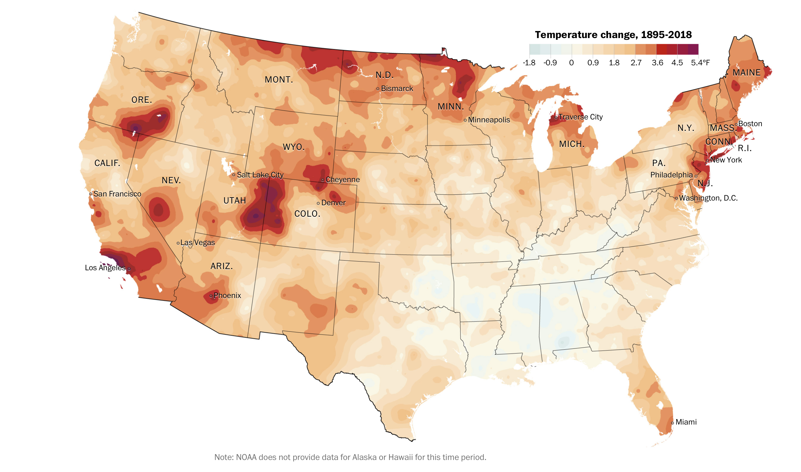
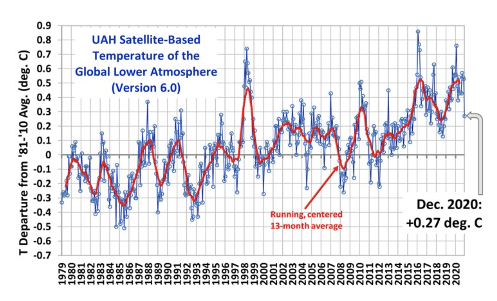

# Data Variablity

```{r, echo=FALSE, warning=FALSE, message=FALSE}
# Chapter packages we will use
library(tidyverse)
```


In the previous chapter, we emphasized that compelling data should be representative
of the population that of interest. We continue that thought process in this chapter
but present some pitfalls relating to only focusing on particular observations
and ignoring the overall trend of the data.


## Individual Chain Reasoning

This type of reasoning is appropriate for understanding issues associated with
particular individuals or situations. The key idea is that if any of the reasoning
steps is false, then the entire premise is dis-proven.

For example, in the handling of evidence a forensics lab for analyzing data in a
police investigation, the chain of possession of the evidence is carefully documented 
so as to argue that evidence tampering is impossible. If the documented chain
of possession is broken in ANY place, then the evidence is no longer considered
reliable.

There are many situations where a single point of failure is a reasonable concern.
When protecting building against intrusion, any single point of weakness will be
exploited.

Lawsuits around legal contracts often demonstrate this line of reasoning. For
example in a housing rental agreement, if one party violates any part of the 
contract, then they are in "Breach of Contract". Television shows would have
us believe the entire contract is thrown out, but it turns out that it depends 
on the severity of the breach.

In all of these cases, we are interested in a SINGLE individual or contract and
not interested in understanding the general relationship between two (or more) 
variables and that any single failure invalidates the premise.


## Population Trends Reasoning

As we try to understand the relationship between variables, we often don't
care about individual data points so much as the overall general relationship.
For example, in the following example we have the amount of time spent studying
for a final exam vs the students score.

```{r, echo=FALSE}
set.seed(83756)
n <- 40
alpha = 1
beta  = 8
data <- data.frame(Time = rgamma(n, rate = 1/alpha, shape=beta)) %>%
  mutate( Score = faraway::ilogit( -1.5 + .4*Time + rnorm(n, sd=.75))*100 ) %>%
  add_case(Time=.5, Score=99) %>%
  mutate(Grp = ifelse(Score==99 & Time == .5, 'Special', 'Ordinary'))

ggplot(data, aes(x=Time, y=Score, color=Grp)) +
  geom_point() +
  scale_color_manual(values = c('black','red')) +
  theme(legend.position = 'none') +
  labs(title = 'Time spent studying vs Score on final exam', 
       x = 'Time (hours)')
```

In general, it is clear that there is a positive relationship between the amount
of time spent studying and the student score on the final exam. There is some
variability among students, but students that study more tend to perform better.

However, there is one student that is extremely unusual (highlighted in red). This
student had actually taken some upper division courses but realized she needed to
take the introductory course in order to graduate. Nobody would reasonably claim
that this student's performance reasonably invalidates the trend. There are always
data points that are unusual and might even be counter to the general trend.


Another example of data variability comes from a US map of change in yearly average
temperature from 1895-2018. The data are from the US National Oceanic and Atmospheric
Administration (NOAA). 




[The Washington Post](https://www.washingtonpost.com/graphics/2019/national/climate-environment/climate-change-america/)
has a good article about these data and it allows you to select states and counties
that you personally might be interested in.

In general, there has been a strong warming across the United States, with much
of the country warming by 1-2 $^\circ$F. There are many locations that have warmed
by a much larger amount, particularly along the Canadian boarder, Southern California,
and the Southern Rocky Mountains. Interestingly, there has been relatively little
warming the southern states of Mississippi and Alabama.

If we were using a "Individual Chain Reasoning", we might argue that for global
warming to be true, then EVERY place on the globe would be warming. Following this,
we would argue that because Alabama isn't warming, then global warming is a hoax.

However, climate scientists are well aware that trapping heat in the atmosphere
and oceans will change predominate wind patterns, and certain areas could actually
cool. Some scientists recognized this as confusing among a lay audience and
suggested 
[global weirding](https://www.nytimes.com/2007/12/02/opinion/02friedman.html?_r=1)
as a way to describe that climate change will lead some places to be hotter while
others might experience colder cold spells or more violent storms, flooding, and
wildfire.

It would be disingenuous to argue that because locations in Alabama are not warming
then the entire phenomena of global climate change must be false. Instead, the totality
of the evidence should be considered. For example, notice that the scale is not
centered at 0 and the "warming" side of the scale has to be A LOT larger than
the cooling side of the scale. 

## Exercises

1.  In 2015, Senator Ted Cruz 
    [claimed](https://www.washingtonpost.com/news/energy-environment/wp/2015/03/24/ted-cruz-says-satellite-data-show-the-globe-isnt-warming-this-satellite-scientist-feels-otherwise/) 
    that issues regarding Global Warming were
    overblown because, for the last 17 years, global temperatures had not risen.
    That is, the average global temperature in 1998 was higher than the average
    global temperature in 2015.
    This reason is quite dubious because it hinges on the year 1998, which was
    an extraordinarily warm year. Looking at a more expanded time series, 

    
    
    it is clear that his choice to look
    at the last 17 years (1998 - 2015) was chosen for a reason. What conclusion
    would he have had if he had considered the previous 15 years or previous 20 years?
    What period of osscilation in global temperatures is apparent in this graph?
    
2.  As of January 12, 2021, eight US Senators (all Republican) have contracted Covid-19.
    Furthermore, only 17 Democratic compared to 33 Republican House of Representative
    members have tested positive (3 of the Democrats tested positive after sheltering
    in-place with Republicans during the Jan 6, 2021 insurrection). Explain why in is not
    inconsistent to say that there is a clear trend that Republican congress members 
    are more likely to contract Covid-19 (presumable due to behavior rather than
    unknown biological differences between Democrats and Republicans), as well as
    there is no guarantees that mask wearing will perfectly prevent transmission.
    That is to say, refute the anecdotal evidence "My sister Connie always wore
    a mask and she still got Covid so I'm not going to bother."


3.  Below is a scatter plot of simulated data that represents the average amount
    of sugar consumed by a teenager per day compared to the number of cavities
    the individual had over a two year period.
    ```{r, echo=FALSE}
    set.seed(314159)
    n <- 50
    data <- data.frame(x=runif(n, min=70, max=120)) %>%
      mutate(y = 0 + (x-70)*.1 + rnorm(n, sd=2)) %>%
      mutate(y = round(y)) %>%
      mutate(y = ifelse(y<0, 0, y))
    
    data %>%
      ggplot(aes(x=x, y=y)) +
      geom_point() +
      labs(x = 'Average Daily Sugar Consumption',
           y = 'Number of Cavities',
           title = 'Sugar vs Cavities over Two Years (Simulated Data)')
```
    Read the Introduction section of the class textbook *"How Charts Lie"* and compare the
    above graph to a similar graph on page 14. Explain the differences in what a single
    dot represents and why the above chart has integer values on the vertical axis while
    the book's does not.

4.  Of the graphs in the Introduction section of the class textbook *"How Charts Lie"*,
    select one graph that you found interesting or surprising. Describe what is 
    being conveyed by the graph and why you found it interesting or insightful.

5.  
