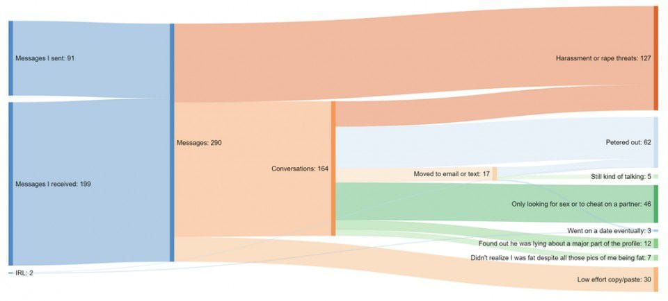

# Proportions

```{r, message=FALSE, warning=FALSE, echo=FALSE}
library(tidyverse)
library(cowplot)
knitr::opts_chunk$set(echo = FALSE, warning=FALSE, message=FALSE, fig.height=4)
```

Conceptually graphing proportions is the same as graph raw values, but sum to 100%. This seemingly small difference means that our graphic can imply that our categories contain ALL possible categories. 

## Single Set 
### Pie Charts

```{r}
MathStat_Faculty_Composition <- read_csv('data-raw/MathStat_Faculty_Composition.csv') %>%
  mutate(Type = fct_collapse(Type, Lecturer  = str_c(c('','Senior ','Principle '), 'Lecturer'))) %>%
  mutate(Type = fct_collapse(Type, Professor = str_c(c('Full','Assistant','Associate'), ' Professor'))) %>%
  group_by(Type) %>% summarize(Number = sum(Number)) %>%
  add_case(Type='GTA', Number=36) %>%
  mutate(Type = fct_relevel(Type, c('GTA','Instructor','Lecturer','Professor'))) %>%
  mutate(Percent = Number/sum(Number) * 100,
         Percent = round(Percent),
         Percent = str_c(Percent, '%'),
         Num_Per = str_c(Number, ' (',Percent,')'))

ggplot(MathStat_Faculty_Composition, aes(x='', y=Number, fill=Type) ) + 
    geom_col( size=1) +
    theme_void() + theme(legend.position = 'right') + coord_polar("y", start=0) + 
    scale_y_continuous(breaks=NULL) +
    labs(title='Pie Chart: NAU Dept of Math & Stat')
```


As typical, with a just a few categories, we should move the labels onto the graph and just annotate the graph. Also, we'll order the categories from the most temporary employees (Graduate Teaching Assistants) to most permanent (Professors)
```{r}
MathStat_Faculty_Composition %>%
  mutate( Text.Location = cumsum(Number) - Number/2 ) %>%
ggplot(., aes(x='', y=Number, fill=Type) ) + geom_col( size=1) +
  #geom_text( aes(label=Type,   y=Text.Location), x=1.2, size=6 ) +
  geom_text( aes(label=Num_Per, y=Text.Location+2), x=1.0, size=6 ) +
  theme_void() + #theme(legend.position = 'none') + 
  coord_polar("y", start=0) + 
  labs(title='Pie Chart: NAU Dept of Math & Stat', size=10)
```


### Stacked Bar
```{r}
MathStat_Faculty_Composition %>%
  mutate( Text.Location = cumsum(Number) - Number/2 ) %>%
ggplot(., aes(x='', y=Number/sum(Number), fill=Type) ) + geom_col( size=.5) +
#  geom_text( aes(label=Type,   y=Text.Location), x=1.2, size=8 ) +
#  geom_text( aes(label=Number, y=Text.Location), x=0.9, size=8 ) +
  # theme(legend.position = 'none') + 
  labs(title='Stacked Bar Chart: NAU Dept of Math & Stat', size=10) +
  labs(x=NULL, y='Percent') +
  cowplot::theme_minimal_hgrid() + 
  scale_y_continuous(expand = expand_scale(mult = c(0, 0.05)) )
```


### Side-by-side Barchart
```{r}
D <- MathStat_Faculty_Composition %>%
  mutate( Text.Location = cumsum(Number) - Number/2 )
P <- ggplot(D, aes(x=Type, y=Number, fill=Type) ) + 
  geom_col( size=.5, alpha=.5) +
  geom_text( aes(label=Number, y=Number-2) ) +
  geom_text( aes(label=Percent, y=Number-4) ) +
  labs(title='NAU Dept of Mathematics & Statistics Faculty', y='', x='') 

P <- P +  
  cowplot::theme_minimal_hgrid() + theme(legend.position = 'none') + 
  scale_y_continuous(breaks=NULL, labels='', 
                      expand = expand_scale(mult = c(0, 0.05)) )
P  
```


|                                                                   |     Pie chart    |    Stacked bars  |   Side-by-side bars  |
|:------------------------------------------------------------------|:----------------:|:----------------:|:--------------------:|
| Clear that data is proportions of a whole                         |      **Yes**     |       **Yes**    |        *no*          |
| Precise visual comparison of values                               |       *no*       |        *no*      |      **Yes**         | 
| Visually appealing even in simple comparisons                     |     **Yes**      |        *no*      |      **Yes**         |
| Extendable to nested or multiple distributions or time series     |      *no*        |       **Yes**    |       *no*           |


## Multiple Sets of Proportions

### Faceted Bar charts
```{r, fig.width=8}
data('EmployedACS', package='Lock5Data')
workers <- EmployedACS %>%
  filter(Age <= 70) %>%
  mutate( Gender = ifelse( Sex == 0, 'Female', 'Male') ) %>%
  mutate( Type = ifelse( HoursWk >= 35, 'Full Time', 'Part Time') ) %>%
  mutate( Age2 = cut(Age, breaks = seq(15,80, by=5)) ) %>%
  mutate( Hours2 = cut( HoursWk, breaks = c(seq(0,50, by=10),99) ) ) %>%
  mutate( Hours2 = fct_rev(Hours2) ) 

workers %>% 
  group_by( Age2, Hours2 ) %>% count() %>%
  group_by(Age2) %>% mutate(Prop = n/ sum(n) ) %>% 
  mutate( Hours = fct_rev(Hours2) ) %>%
  ggplot(., aes(x=Age2, y=Prop, fill=Hours) ) + 
  geom_col(alpha=.8) +
  facet_grid(. ~ Hours, labeller=label_both) +
  labs(title='Faceted Bar Chart: Hours worked by age group', 
       subtitle='(only employeed individuals).', y='', x='Age', fill='Hours') +
  cowplot::theme_minimal_hgrid() + cowplot::panel_border() +
  scale_y_continuous(breaks=c(.25,.5,.75), labels=c('25%', '50%','75%'), 
                      expand = expand_scale(mult = c(0, 0)) ) +
  coord_flip() +
  theme(legend.position = 'none')
```

```{r}
data('Titanic')
Titanic <- as.data.frame(Titanic) %>%
  mutate( Class = fct_rev(Class) ) %>%
  mutate( Survived = fct_recode(Survived, Died='No', Lived='Yes') ) %>%
  group_by(Class, Age, Class) %>%
  mutate( Proportion = Freq/sum(Freq) )  
ggplot(Titanic, aes(x=Sex, y=Freq, fill=Survived))+
  geom_col() +
  facet_grid(Age~Class, scales='free_y') +
  labs(title='Faceted Stacked Bar plots: Survival of Titanic Passengers and Crew') 
```
```{r}
ggplot(Titanic, aes(x=Sex, y=Freq, fill=Survived))+
  geom_col() +
  facet_grid(Age~Class) +
  labs(title='Faceted Stacked Bar plots: Survival of Titanic Passengers and Crew') 
```
```{r}
ggplot(Titanic, aes(x=Sex, y=Proportion, fill=Survived))+
  geom_col() +
  facet_grid(Age~Class) +
  labs(title='Faceted Stacked Bar plots: Survival of Titanic Passengers and Crew') 
```


### Side-by-Side Stacked Barcharts

```{r, fig.width=8}
data('EmployedACS', package='Lock5Data')
workers <- EmployedACS %>%
  filter(Age <= 70) %>%
  mutate( Gender = ifelse( Sex == 0, 'Female', 'Male') ) %>%
  mutate( Type = ifelse( HoursWk >= 35, 'Full Time', 'Part Time') ) %>%
  mutate( Age2 = cut(Age, breaks = seq(15,80, by=5)) ) %>%
  mutate( Hours2 = cut( HoursWk, breaks = c(seq(0,50, by=10),100) ) ) %>%
  mutate( Hours2 = fct_rev(Hours2) ) 

workers %>% 
  group_by( Age2, Hours2 ) %>% count() %>%
  group_by(Age2) %>% mutate(Prop = n/ sum(n) ) %>% 
  ggplot(., aes(x=Age2, y=Prop, fill=Hours2) ) + 
  geom_col(alpha=.8) +
  labs(title='Hours worked by age group', subtitle='(only employeed individuals).', y='', x='', fill='Hours') +
  cowplot::theme_minimal_hgrid() +
  scale_y_continuous(breaks=c(.25,.5,.75), labels=c('25%', '50%','75%'), 
                      expand = expand_scale(mult = c(0, 0)) )
```


### Mosiac plots
Sort like side-by-side stacked bar charts, but now we allow the column width to vary as well. The area is proportional the groups representation in the whole data. This reduces the number of really thin bands because we can make the column narrower as well.
```{r}
library(ggmosaic)
data('Titanic')
Titanic <- 
  data.frame(Titanic) %>%
  filter(Freq != 0) %>%
  group_by(Class, Sex, Age, Survived) %>%
  do({ data.frame( Class = .$Class, Sex = .$Sex, Age=.$Age, Survived=.$Survived, rep=1:.$Freq) })


ggplot(Titanic) +
  geom_mosaic(aes(x=product(Sex, Class), fill=Survived), offset=.01) +
  labs(title='Mosaic Plot: Survival of Titanic Passengers and Crew') +
  theme(axis.text.x = element_text(angle = 45, vjust = 1, hjust=1))
```


```{r, fig.width=8}
data('EmployedACS', package='Lock5Data')
workers <- EmployedACS %>%
  filter(Age <= 70) %>%
  mutate( Gender = ifelse( Sex == 0, 'Female', 'Male') ) %>%
  mutate( Type = ifelse( HoursWk >= 35, 'Full Time', 'Part Time') ) %>%
  mutate( Age2 = cut(Age, breaks = seq(15,70, by=5)) ) %>%
  mutate( Hours2 = cut( HoursWk, breaks = c(seq(0,50, by=10),100) ) ) %>%
  mutate( Hours2 = fct_rev(Hours2) ) 

workers %>% 
  ggplot(.) +
  geom_mosaic( aes( product(Hours2, Age2), fill=Hours2)) +
  labs(title='Hours worked by age group', 
       subtitle='(only employeed individuals).', 
       y='Hours', x='Age', fill='Hours') +
  scale_fill_discrete(guide = guide_legend(reverse = TRUE) )

```


### Alluvial Plots
If we want to compare multiple categorical variables, another option is alluvial plots.
```{r}
data('Titanic')
library(ggalluvial)
as.data.frame(Titanic) %>%
  mutate( Class = fct_rev(Class) ) %>%
  mutate( Survived = fct_recode(Survived, Died='No', Lived='Yes') ) %>%
  mutate( Age = fct_rev(Age) ) %>%
ggplot(., aes(y = Freq, axis1=Class, axis2 = Survived, axis3=Age, axis4=Class)) +
  #geom_alluvium(aes(fill = Sex), width = 1/12, knot.pos = 0, reverse = FALSE) +
  guides(fill = FALSE) +
  geom_flow(aes(fill=Sex), reverse=TRUE) +
  geom_stratum(reverse=TRUE) +
  geom_text(stat = "stratum", label.strata = TRUE) +
  scale_x_discrete(breaks = 1:4, labels = c("Class","Survived", "Sex", "Class"), expand=c(.05, .05)) +
  scale_fill_manual( values=c('blue', 'red')) +
  ggtitle("Alluvial Plots: Titanic survival by class and sex")
```


I find that alluvial plots work better for events that have a definate chronological order and there is less stream overlaps.. Here is an example from a [Washington Post story](https://www.washingtonpost.com/news/soloish/wp/2018/03/12/these-redditors-made-graphics-to-visualize-their-dating-lives-heres-what-they-can-teach-us/) about people graphing their online dating interactions. 




### Tree graphs

In mosaic plots, we had *crossed* variables where every category level of one factor could show up with all levels of another factor. 

```{r}
Crossed <- data.frame( `Factor 1` = c('A','A', 'B','B'),
                       `Factor 2` = c('w','x', 'w','x'),
                       value      = c( 4, 6,    15, 25))
pander::pander(Crossed)
```
Table: Crossed Factors Suitable for a Mosaic Plot. 


Another possibility is that the variables are nested such that a category level of the second factor only ever occurs within a single level of the first factor.

```{r}
Nested <- data.frame( `Factor 1` = c('A','A', 'B','B'),
                      `Factor 2` = c('w','x', 'y','z'),
                      value      = c( 4, 6,    15, 25))
pander::pander(Nested)
```
Table: Nested Factors Suitable for a Tree Map. 


When we have a hierarchical structure of categories, then mosaic plots aren't quite right. Instead we'll hierarchically subdivide the graph area up.
```{r}
library(gapminder)
library(treemapify)
gapminder %>%
  filter( year == 2007 ) %>%
ggplot(., aes(label = country, area = pop, subgroup = continent, fill = lifeExp)) +
  geom_treemap(layout = "fixed") +
  geom_treemap_text(layout = "fixed", place = "centre", grow = TRUE, colour = "white") +
  geom_treemap_subgroup_text(layout = "fixed", place = "centre") +
  geom_treemap_subgroup_border(layout = "fixed") +
  labs(title='Tree map: Population vs Life Expectancy in 2007')

```

The graph first separates the graph into continents and scales the area of each continent by the population of the continent. Then each continent is split into the countries that compose the continent, again with area representing population. Finally the countries are color-coded by their 2007 life expectancy.

This differs from a moasic plot in that a country only occurs withing one continent whereas in a mosaic plot, a category level will occur in multiple "containers".


## Exercises

1. Alluvial plots are a particular type of *Sankey* graphs which show flow rates and amounts and have been around for quite some time. In 1869, Charles Minard created a graphic that details the size of Napaleon's army as they marched on Russia and subsequently returned. You can find the [original](https://en.wikipedia.org/wiki/Charles_Joseph_Minard) or the [modern English translation](https://en.wikipedia.org/wiki/Charles_Joseph_Minard#/media/File:Minard_Update.png) on Wikipedia. 
    a) How many men did the army start marching with?
    b) How many men arrived in Moscow?
    c) How many men died crossing the Berezina River on the return trip? (approximately from the map information provided)
    d) How cold was it when they cross the Berezina River on the retern trip?
    
2. Read Chapter 10 and 11 in Claus Wilke's Fundamentals of Data Visualiztion [book](https://serialmentor.com/dataviz/). In chapter 10 he presents several different graphics that visualize the bridge construction era, bridge material, and which river they cross for bridges near Pittsburgh, Pennsylvania. Discuss three of them and explain which graph you prefer and why.

3. Download data about the [Titanic](https://raw.githubusercontent.com/dereksonderegger/141/master/data-raw/Titanic.csv) disaster at the GitHub site for this class. Save the file as a Titanic.csv and open it in Tableau. 
    a) In Tableau, a faceted stacked barchart just as we did in these notes.
    b) In a new worksheet, copy your faceted stacked barchart and then turn it into faceted pie charts.
    c) Comment on which you prefer and why.
    d) Finally create a mosaic plot of the Titantic dataset. 
    
    
