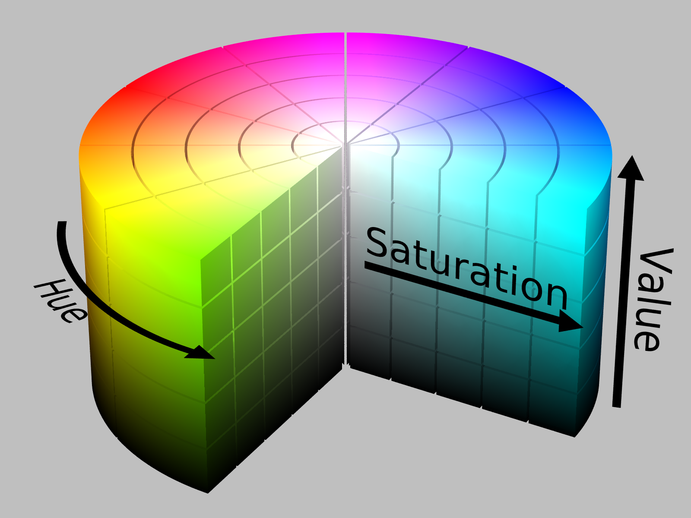

# Graphing Principles

```{r, echo=FALSE, warning=FALSE, message=FALSE}
# Unattach any packages that happen to already be loaded. In general this is unecessary
# but is important for the creation of the book to not have package namespaces
# fighting unexpectedly.
pkgs = names(sessionInfo()$otherPkgs)
if( length(pkgs > 0)){
  pkgs = paste('package:', pkgs, sep = "")
  for( i in 1:length(pkgs)){
    detach(pkgs[i], character.only = TRUE, force=TRUE)
  }
}

library(tidyverse) # dplyr, tidyr, ggplot2, etc.
library(ggrepel)

knitr::opts_chunk$set(echo = FALSE)
```


Some visual tasks are easier than others because our visual processing 
evolved to do certain tasks. Our visual cortex is well developed to compare
heights and spatial relationships. We do well comparing 3 or 4 colors, but
are terrible distinguishing 8 or more colors. We are also bad at comparing
areas and volumes as well as comparing heights when there isn't a common
reference point.

## Elementary Perception Tasks
We can break basic graph reading tasks into a hierarchy of tasks that 
range between very quick and precise to extremely difficult.


Ideally we will create a graph that utilizes tasks that are easier compared to 
tasks that are harder.

```{r}
data <- data.frame(Type=c('A','B','C'), Value = c(.28, .4, .32) )

P1 <- ggplot(data, aes(x=Type, y=Value, fill=Type)) + 
  geom_col() +
  labs(y='Proportion')
P2 <- ggplot(data, aes(x=1, y=Value, fill=Type)) + 
  geom_col() + 
  coord_polar("y", start=.27 ) +
  cowplot::theme_map()

P2
```
Which graph is Type is larger? Is it Type B perhaps? Between the other two, which
is larger? This is not easy to tell, but in the following graph, the answer is
obvious because we can compare the heights of the bars relative to a common axis.

```{r}
P1
```


## Groupings / Gestalt

The way we organize our graphics can lead a viewer to create mental groups of marks.

The way we form groupings can be in one of the following ways, (where higher 
grouping methods produce a stronger grouping effect.

1. Enclosures
2. Connections
3. Proximity
4. Similarity (color is better than shape)


In the following example, find all the fives:
```{r, fig.height=4, fig.width=7}
seed <- runif(1, 0,1e7) %>% round();
seed <- 1863486
set.seed(seed)
n <- 40
fives <- data.frame(x=runif(n), y=runif(n), label = runif(n, 0,10) %>% floor()) %>%
  mutate(Group = label == 5)

ggplot(fives, aes(x=x, y=y, label=label)) +
  geom_text_repel() +
  theme_bw() +
  scale_x_continuous(breaks=NULL) +
  scale_y_continuous(breaks=NULL) +
  labs(y=NULL, x=NULL)
```

If instead, we form a grouping by adding color, then the group of fives stands 
out prominently.
```{r, fig.height=4, fig.width=7}
ggplot(fives, aes(x=x, y=y, label=label, color=Group)) +
  geom_text_repel() +
  theme_bw() +
  scale_color_manual( values = c('black','red')) + 
  scale_x_continuous(breaks=NULL) +
  scale_y_continuous(breaks=NULL) +
  theme(legend.position = 'none') +
  labs(y=NULL, x=NULL)
```
*This example was inspired by an example by Alberto Cairo.*

### Grouping Examples

In the following examples, ask yourself what the visual grouping the graph is 
encouraging? Are the rows or columns grouped? 
*These are taken from a presentation by Todd Iverson and Silas Bergen.*

```{r, fig.height=4}
expand.grid(x=1:4, y=1:4) %>%
  mutate(group=ifelse(y %in% c(2,4), 'G1', 'G2')) %>%
  ggplot(aes(x=x, y=y, shape=group)) +
  geom_point(size=16) +
  theme_bw() + 
  scale_x_continuous(breaks=NULL, limits = c(-.5, 5.5)) +
  scale_y_continuous(breaks=NULL, limits = c(.5, 4.5)) +
  theme(legend.position = 'none') +
  labs(y=NULL, x=NULL)
```

```{r, fig.height=4}
expand.grid(x=1:4, y=1:4) %>%
  mutate(group=ifelse(x %in% c(2,4), 'G1', 'G2')) %>%
  ggplot(aes(x=x, y=y, color=group)) +
  geom_point(size=16) +
  theme_bw() + 
  scale_x_continuous(breaks=NULL, limits = c(-.5, 5.5)) +
  scale_y_continuous(breaks=NULL, limits = c(.5, 4.5)) +
  theme(legend.position = 'none') +
  labs(y=NULL, x=NULL)
```

```{r, fig.height=4}
expand.grid(x=1:4*2, y=1:4) %>%
  mutate(group='G1') %>%
  ggplot(aes(x=x, y=y, color=group)) +
  geom_point(size=16) +
  theme_bw() + 
  scale_x_continuous(breaks=NULL, limits = c(1.5, 8.5)) +
  scale_y_continuous(breaks=NULL, limits = c(.5, 4.5)) +
  theme(legend.position = 'none') +
  labs(y=NULL, x=NULL)
```

```{r, fig.height=4}
expand.grid(x=1:4, y=1:4) %>%
  mutate(group=paste('G', y, sep='')) %>%
  ggplot(aes(x=x, y=y, group=group)) +
  geom_point(size=16) +
  geom_line() +
  theme_bw() + 
  scale_x_continuous(breaks=NULL, limits = c(-.5, 5.5)) +
  scale_y_continuous(breaks=NULL, limits = c(.5, 4.5)) +
  theme(legend.position = 'none') +
  labs(y=NULL, x=NULL)
```

Notice in this example, we have two levels of grouping.
```{r, fig.height=4}
no_label <- as_labeller( function(input){ ifelse(input=='G1', ' ', '  ')} )
expand.grid(x=1:2, y=1:4, group=c('G1','G2')) %>%
  ggplot(aes(x=x, y=y, group=group)) +
  geom_point(size=16) +
  facet_grid(.~group, labeller=no_label) +
  theme_bw() + 
  scale_x_continuous(breaks=NULL, limits = c(.5, 2.5)) +
  scale_y_continuous(breaks=NULL, limits = c(.5, 4.5)) +
  theme(legend.position = 'none') +
  labs(y=NULL, x=NULL)
```


Some grouping is stronger than others

```{r, fig.height=4}
expand.grid(x=1:4, y=1:4) %>%
  mutate(group=paste('G', y, sep='')) %>%
  mutate(shape_group = ifelse(x %in% c(1,3), 'S1','S2')) %>%
  ggplot(aes(x=x, y=y, group=group)) +
  geom_point(mapping = aes(shape=shape_group), size=16, ) +
  geom_line() +
  theme_bw() + 
  scale_x_continuous(breaks=NULL, limits = c(-.5, 5.5)) +
  scale_y_continuous(breaks=NULL, limits = c(.5, 4.5)) +
  theme(legend.position = 'none') +
  labs(y=NULL, x=NULL)
```

```{r, fig.height=4}
no_label <- as_labeller( function(input){ ifelse(input=='G1', ' ', '  ')} )
expand.grid(x=1:2, y=1:4, group=c('G1','G2')) %>%
  mutate(shape_group = ifelse(x %in% c(1,3), 'S1','S2')) %>%
  ggplot(aes(x=x, y=y, group=group)) +
  geom_point(aes(shape=shape_group), size=16) +
  facet_grid(.~group, labeller=no_label) +
  theme_bw() + 
  scale_x_continuous(breaks=NULL, limits = c(.5, 2.5)) +
  scale_y_continuous(breaks=NULL, limits = c(.5, 4.5)) +
  theme(legend.position = 'none') +
  labs(y=NULL, x=NULL)
```


### Example: Warpbreaks
While spinning wool into thread, if the tension on the wool isn't correctly set, 
the thread can break. Here we compare two different types of wool at three 
different tensions.

```{r, echo=FALSE, fig.height=3, warning=FALSE, message=FALSE}
library(ggplot2)
library(dplyr)
means <- warpbreaks %>% group_by(tension, wool) %>% 
  summarize(breaks=mean(breaks))
                                                              
ggplot( warpbreaks, aes(x=tension, y=breaks, shape=wool)) +
  geom_point() +
  ggtitle( "Can't easily distiguish wool types.")
  
ggplot( warpbreaks, aes(x=tension, y=breaks, shape=wool, color=wool)) +
  geom_point() +
  ggtitle( "Can't see the trend.")

ggplot( warpbreaks, aes(x=tension, y=breaks, color=wool)) +
  geom_point(aes(shape=wool)) +
  geom_line(data=means, aes(x=as.numeric(tension), y=breaks)) +
  ggtitle( "Adding connections between means, the trend is clear")

ggplot( warpbreaks, aes(x=tension, y=breaks, color=wool)) +
  geom_point(aes(shape=wool)) +
  geom_line(data=means, aes(x=as.numeric(tension), y=breaks)) +
  facet_grid(. ~ wool) +
  ggtitle( "Trend is clear, but magnitude is harder")

ggplot( warpbreaks, aes(x=tension, y=breaks, color=wool)) +
  geom_point(aes(shape=wool)) +
  geom_line(data=means, aes(x=as.numeric(tension), y=breaks)) +
  facet_grid(wool ~ .) +
  ggtitle( "Non-Aligned y-axis is worse")

```


## "Color" Scales

Defining Color really has three different attributes (From [Wikipedia](https://en.wikipedia.org/wiki/HSL_and_HSV)).

#### HSV Scale
*  Hue: The attribute of a visual sensation according to which an area appears 
   to be similar to one of the perceived colors: red, yellow, green, and blue, 
   or to a combination of two of them.
* Saturation: The "colorfulness of a stimulus relative to its own brightness"
* Value: The "brightness relative to the brightness of a similarly illuminated white"



* Hue is appropriate for categorical variables.
* Saturation and/or Value is appropriate for a quantitative variable scale.

Neither R nor Tableau make it particularly easy to map these aspects, 
so we won't get too deep into it.


## Examples
### RobinHood App
The brokerage firm RobinHood is a low cost stock trading platform that purports
to make the stock market accessible to everyone. However in the middle of the
GameStop short-squeeze, it blocked users from buying GameStop shares and the
users retaliated by leaving negative reviews on the Apple App store.

<!--  -->


What EPTs are being used? What Grouping structure is being used?

*There are actually two EPTs being used. First, we are comparing the number*
*of reviews each day to a common axis. So it is very easy to see the peak*
*number of reviews on Jan 7. We also have that same information encoded using*
*the length of the bar. Bar charts are easy to read because the same information*
*is encoded in the graph two different ways.*
*There are two types of grouping going on. First, the color grouping is encoding*
*if the review was positive or negative. Second, there is also a day grouping*
*that is encoded by the space between the bars.*

### Coffee Varieties & Origins
In this example, we have information about the country of origin and
coffee types. This is an 
[interactive](https://datacrayon.com/posts/statistics/data-is-beautiful/arabica-coffee-beans-origin-and-variety/)
graph and reader can select a country
or variety and see the corresponding item.


What EPTs are being used? What Grouping structure is being used?

*While it isn't stated anywhere in the graph, I think the length of the bars*
*is related to the amount of coffee exported. I initially thought that perhaps*
*the color of the country was related to the county continent or region, but on*
*deeper inspection I think the color is just randomly assigned to country. The*
*color does basic grouping for the lines traversing from a coffee type to the*
*country.*

### Trade with Britain
In this scatter plot example, the x and y-axes are a country's GDP growth versus
the its growth in trade with Britain. So data points above the 1-to-1 line have
increased their economic ties with Britain and points below have reduced their
ties.


What EPTs are being used? What Grouping structure is being used?

*In this example the primary relationship being explored is the change in*
*economic ties with Britain. This is encoded using the common scales EPT.*
*The overall size of the country's trade with Britain is encoded using the point area.* 
*It is hard to detect fine differences (for example it is unclear if Poland, Turkey,*
*or India has more trade with Britain. There isn't any grouping structure in this graph.*

## Exercises

1.  In soccer, Kylian Mbappé is being referred to as the next world dominating 
    player. The graphic below compares Mbappé to soccer greats Cristiano Ronaldo 
    and Lionel Messi. Below is a graph showing the number of goals scored during 
    various parts of their career (first 100 professional games, second 100, etc). 
    
    
    a.  Identify the EPT the reader is required to perform and the grouping 
        structures used. *Notice the grouping structure is nested. This forces*
        *the user first look at the trends within a top level group and then ask*
        *if the trend remains the same across the different groups.*
    b.  Comment on how the grouping was effective or if you think some change 
        might be better.
    
2.  In NBA basketball, shot accuracy and distance from the net is important. In 
    the following graph, we can investigate how often shots are taken from different 
    distances. In the first graph, the y-axis is the cumulative percentage of all
    shots taken. So a steep slope means that lots of shots are taken at that distance
    and a shallow slope means very few shots are taken.
    
    
    a.  Identify the EPT the reader is required to perform in the top and bottom
        graph. Comment on which graph you understood more easily and why. 
    b.  Comment on how the grouping of distance and which was more effective
        and informative.
    
3.  The following graphic calculates difference between a month's temperature 
    compared to the monthly average temperature across the years since 1850. For 
    example, this graph compares the average January 2014 temperature to the 
    average January temperature across the last 170 Januaries.)

    
    a.  Identify the EPT the reader is required to perform and the grouping 
        structures used.
    b.  Comment on how the grouping was effective or if you think some change 
        might be better.
    
4.  Find a graphic "in the wild" that you think is interesting. Turn in both the 
    original graphic as well as your answers to the following:
    a.  Identify the EPT the reader is required to perform and the grouping 
        structures used.
    b.  Comment on how the graph was effective or if you think some change 
        might improve the graph.