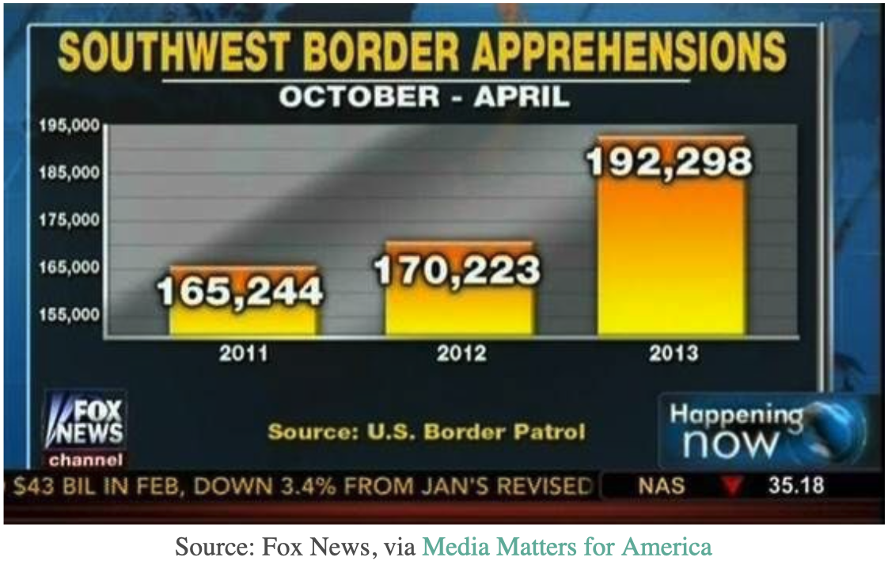
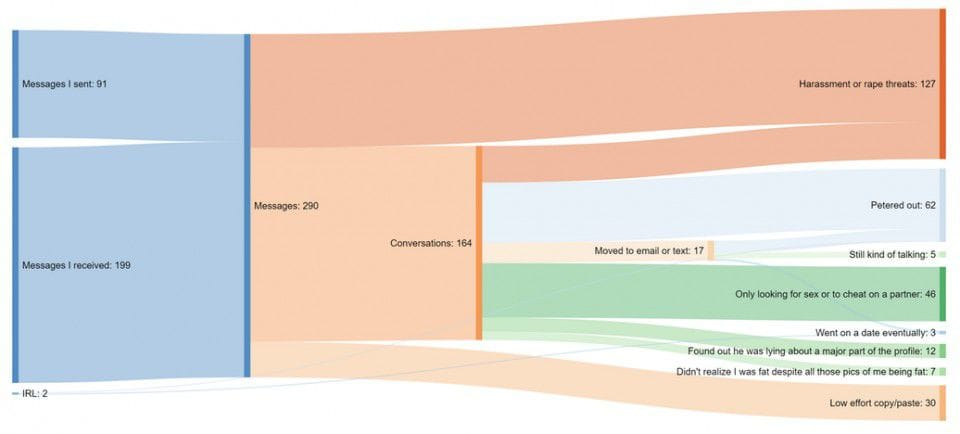

# A Selection of Graph Examples


```{r, warning=FALSE, message=FALSE, echo=FALSE}
# Un-attach any packages that happen to already be loaded. In general this is unnecessary
# but is important for the creation of the book to not have package namespaces
# fighting unexpectedly.
pkgs = names(sessionInfo()$otherPkgs)
if( length(pkgs > 0)){
  pkgs = paste('package:', pkgs, sep = "")
  for( i in 1:length(pkgs)){
    detach(pkgs[i], character.only = TRUE, force=TRUE)
  }
}

# Chapter packages we will use
library(tidyverse)
library(cowplot)
library(treemapify)
library(ggmosaic)
library(ggalluvial)


# Don't show the R code!
knitr::opts_chunk$set(echo = FALSE, warning=FALSE, message=FALSE)
```

## Introduction
This chapter focuses on displaying a single numerical variable versus one or more 
categorical variables. To display the quantitative variable, we'll try to stay at 
the top of the EPT tasks and the quantitative variable will be quantified with 
either the `x` or `y` axis or using length. The exception to this is the heat map, 
where the quantitative variable is encoded by the color of the tile.

```{r, echo=FALSE}
data <- tribble(
  ~Quant, ~Cat1, ~Cat2, ~Cat3,
  3,  'A', 'W', 'A',
  2,  'A', 'X', 'B',
  3,  'A', 'Z', 'C',
  4,  'B', 'W', 'D',
  4,  'B', 'X', 'E',
  5,  'B', 'Z', 'F',
  2,  'C', 'W', 'G',
  3,  'C', 'X', 'H',
  4,  'C', 'Z', 'I')

P1 <- 
  data %>%
  group_by(Cat1) %>% summarise(Quant = sum(Quant)) %>%
  ggplot(aes(x=Cat1, y=Quant)) + 
  geom_point() + 
  theme_cowplot() +
  theme(axis.ticks.x = element_blank(),
        axis.title = element_blank(),
        axis.text = element_blank() ) +
  labs(title='Points')

P2 <- 
  data %>%
  group_by(Cat1) %>% summarise(Quant = sum(Quant)) %>%
  ggplot(aes(x=Cat1, y=Quant, fill=Cat1)) + 
  geom_col() +
  theme_cowplot() +
  theme(axis.ticks.x = element_blank(),
        axis.title = element_blank(),
        axis.text = element_blank(),
        legend.position = 'none') +
  labs(title='Bars')


no_label <- as_labeller( function(input){ ifelse(input=='G1', ' ', '  ')} )
P3 <- 
  data %>%
  ggplot(aes(x=Cat1, y=Quant, fill=Cat1)) + 
  geom_col() + facet_grid(.~Cat2, labeller=no_label) +
  theme_cowplot() +
  theme(axis.ticks.x = element_blank(),
        axis.title = element_blank(),
        axis.text = element_blank(),
        legend.position = 'none') +
  labs(title='Grouped Bars')


P4 <- 
  data %>%
  ggplot(aes(x=Cat2, y=Quant, fill=Cat1)) + 
  geom_col() + 
  theme_cowplot() +
  theme(axis.ticks.x = element_blank(),
        axis.title = element_blank(),
        axis.text = element_blank(),
        legend.position = 'none') +
  labs(title='Stacked Bars')


P5 <-   
  data %>%
  ggplot(aes(x=Cat1, y=Cat2, fill=Quant)) + 
  geom_tile() + 
  theme_cowplot() +
  theme(axis.ticks.x = element_blank(),
        axis.title = element_blank(),
        axis.text = element_blank(),
        legend.position = 'none') +
  labs(title='Heat Map')

data2 <- tribble(
  ~Quant, ~Cat1, ~Cat2, ~Cat3, ~Cat4,
  2,  'A', 'W', 'A', TRUE,
  2,  'A', 'W', 'A', FALSE,
  1,  'A', 'X', 'B', TRUE,
  1,  'A', 'X', 'B', FALSE,
  3,  'A', 'Z', 'C', TRUE,
  3,  'A', 'Z', 'C', FALSE,
  4,  'B', 'W', 'D', TRUE,
  4,  'B', 'W', 'D', FALSE,
  4,  'B', 'X', 'E', TRUE,
  4,  'B', 'X', 'E', FALSE,
  4,  'B', 'Z', 'F', TRUE,
  4,  'B', 'Z', 'F', FALSE,
  6,  'C', 'W', 'G', TRUE,
  6,  'C', 'W', 'G', FALSE,
  8,  'C', 'X', 'H', TRUE,
  8,  'C', 'X', 'H', FALSE,
  9,  'C', 'Z', 'I', TRUE,
  9,  'C', 'Z', 'I', FALSE)

P6 <- data %>%
  ggplot(aes(label=Cat3, area=Quant, subgroup=Cat1, fill=Cat1)) +
  geom_treemap(color='black') +
  geom_treemap(layout = "fixed") +
  geom_treemap_text(layout = "fixed", place = "centre", grow = FALSE, colour = "white") + 
  theme(legend.position = 'none') +
  labs(title='Tree Maps')

P7 <- 
  data2 %>%
  ggplot() +
  geom_mosaic( aes(x=product(Cat1,Cat2), fill=Cat4, weight=Quant), offset=.01) +
  labs(x='', y='', title='Mosaic Plots') +
  theme_bw() + theme(legend.position = 'none') +
  scale_x_productlist(breaks=c(.145,.45,.81), labels=c('W','X','Y') ) 

cowplot::plot_grid(P1, P2, P3, P4, P5, P6, P7, ncol = 2)
```

### Example 1
The 2020 presidential candidate field has a wide range of ages. 
The 
[New York Times](https://www.nytimes.com/interactive/2019/06/09/us/politics/2020-democractic-candidates-ages.html)
has a nice article showing the candidate ages. I grabbed a few of the most 
prominent candidates and pulled their birthdays from Wikipedia and then calculated 
their age on election day. As usual the data is [available](https://raw.githubusercontent.com/dereksonderegger/141/master/data-raw/Prez_Candidate_Birthdays) 
on the Github pages for this book. 

```{r, echo=FALSE, message=FALSE, fig.height=5}
birth <- read_csv('~/GitHub/141/data-raw/Prez_Candidate_Birthdays.csv')
ggplot(birth, aes(x=Candidate, y=AgeOnElection)) + 
  geom_point() +
  labs(x='Candidate', y='Age on Nov 3,  2020', title='Ages of Presidential Candidates') +
  coord_flip()
```

The order of the candidates is useless. Here we have ordered them alphabetically 
when we should try to think about an ordering that improves clarity. Lets switch 
to sorting the candidates by age.

```{r, echo=FALSE, message=FALSE, fig.height=5}
birth <- birth %>%
  mutate(Candidate = fct_reorder(Candidate, AgeOnElection))  
ggplot(birth, aes(x=Candidate, y=AgeOnElection, color=Party)) + 
  geom_point() +
  scale_color_manual(values=c('Blue','Red')) +
  labs(x='Candidate', y='Age on Nov 3,  2020', title='Ages of Presidential Candidates') +
  coord_flip()
```

This isn't too bad, but it fails to visually impress the differences. A bar chart 
should visually impress the ages based on the length of the bar so that we don't 
have to keep looking at the Age axis.

```{r, echo=FALSE, message=FALSE, fig.height=5}
birth %>%
  mutate(Candidate = fct_reorder(Candidate, AgeOnElection))  %>%
ggplot( aes(x=Candidate, y=AgeOnElection, fill=Party)) + 
  geom_col() +
  scale_fill_manual(values=c('Blue','Red')) +
  labs(x='Candidate', y='Age on Nov 3,  2020', title='Ages of Presidential Candidates') +
  coord_flip()
```

The reason that bar charts are widely used is that they use *both* a common axis
and *area* to represent the data. So we can easily see that Bernie Sanders is just
a little older
than Joe Biden. We can accurately calculate the difference between the two but we
can also estimate the percent difference based on the area of the bar. By using
two EPTs to encode this information, bar charts are particularly easy to interpret.
In particular our eyes use the area information to get the general relationships
and only use the axis scale if we want to be precise.

What would be *dishonest* is if we were to chop off the bars at 35 or 40 to make 
the age difference between Buttigieg and Warren, Trump, Biden and Sanders seem huge.
The problem is that now the bar *areas* are no longer proportional to the axis value.
By having the numerical axis and the bar area giving contradictory information,
we can sensationalize the differences and mislead our audience because most people
will only look at the area differences.

```{r, echo=FALSE, message=FALSE, fig.height=5}
birth <- birth %>%
  mutate(candidate = fct_reorder(Candidate, AgeOnElection))  
ggplot(birth, aes(x=Candidate, y=AgeOnElection, fill=Party)) + 
  geom_col() +
  scale_fill_manual(values=c('Blue','Red')) +
  labs(x='Candidate', y='Age on Nov 3,  2020', title='Ages of Presidential Candidates - WRONG!') +
  coord_flip(ylim=c(35,80)) 
```

Unfortunately this sort of shenanigan is common among biased journalism.
Below are three examples of Fox News doing this exact trick.




### Example 2

In this section we'll consider two categorical variables. In this example, we have 
the results from a survey administered to students in an introductory statistics 
class at a New York university. We'll compare the number of student responses broken 
down by year in school and gender. 

```{r}
data('StudentSurvey', package='Lock5Data')
StudentSurvey <- StudentSurvey %>%
  filter(Year != '') %>%
  mutate(Year = fct_relevel(Year, 'FirstYear','Sophomore','Junior','Senior')) %>%
  mutate(Year = fct_recode(Year, 'First Year' = 'FirstYear')) %>%
  group_by(Year, Gender) %>% count()

StudentSurvey %>%
  ggplot( aes(x=Gender, fill=Year, y=n)) +
  geom_col() +
  labs(y='Number of Surveys') +
  labs(title='Stacked Bar Chart (by year)') +
  theme_bw()
```

The first thing I notice is that there is approximate gender equality, but there 
are a few more males in class. It is only really possible to compare the genders
among the Seniors because they start at the same point (common axis) but the
other years don't start at the same point (uncommon axis).

After a more detailed look, I see that the most 
abundant class is sophomores, followed by first years, and juniors and seniors 
are approximately equally abundant. If we switch the grouping order and use color 
to denote gender and columns to denote the classes, the abundance of sophomores 
is the first insight to be noticed.

```{r}
StudentSurvey %>%
  ggplot( aes(x=Year, fill=Gender, y=n)) +
  scale_fill_manual(values=c('pink','light blue')) +
  geom_col() +
  labs(y='Number of Surveys') +
  labs(title='Stacked Bar Chart (stacked by gender)') +
  theme_bw()
```

Here I chose to encode the gender information using a somewhat obnoxious convention
of males encoded as blue and females with pink. As a result, there is less confusion
and double checking of the legend. This type of decision should be used whenever
possible so that the color assignments make sense. However, we should be careful
so that the color choices aren't offensive (e.g. making color choices encoding 
ethnicity!)

As another way to show these data, we could use side-by-side bar charts instead 
of stacked bars.

```{r}
StudentSurvey %>%
  ggplot( aes(x=Gender, fill=Gender, y=n)) +
  geom_col(position='dodge') +
  scale_fill_manual(values=c('pink','light blue')) +
  facet_grid(.~Year) +
  labs(y='Number of Surveys') +
  labs(title='Side-by-Side Bar Chart') +
  theme_bw()
```


### Example 3

Often we need to graph some value and want to know how it varies among *two* 
different categories. In these cases, we have to employ some sort of grouping strategy.

```{r, echo=FALSE}
data('gapminder', package='gapminder')
G7 <- c('United States', 'Canada', 'France', 'United Kingdom', 
        'Germany', 'Italy', 'Japan')
gapminder_G7 <- gapminder %>%
  filter( country %in%  G7) %>%
  mutate( decade = cut(year, breaks = seq(1950, 2010, by=10), right=FALSE, labels = paste(seq(1950,2000,by=10),'s',sep=''))) %>%
  mutate(country = fct_relevel(country, c('Japan','Italy','Canada','France','Germany','United Kingdom', 'United States' )) )


gapminder_G7 %>%
  group_by(continent, country, decade) %>%
  summarize(lifeExp = median(lifeExp), .groups='drop' ) %>% 
  filter(decade == '2000s') %>%
  ungroup() %>%
  mutate(country = fct_reorder(country, desc(lifeExp) )) %>%
ggplot(., aes(x=country, y=lifeExp)) +
  geom_col() +
  labs(title='Life Expectancy among G7 Countries in 2007', y='Life Expectancy')
```

The bar chart here is obscuring the differences in life expectancies because the 
numbers are so close. In this case, I think points make more sense. Also I want 
to see how life expectancy has changed since World War II.


```{r, echo=FALSE}
ggplot(gapminder_G7, aes(x=year, y=lifeExp)) +
  geom_point() + geom_line() +
  facet_grid( . ~ country) +
  scale_x_continuous(breaks = seq(1950, 2010,  by=20)) + 
  labs(title='Life Expectancy among G7 Countries (1950 - 2007)', y='Life Expectancy',
       x='') 
```

In the above graph, I am grouping countries both by enclosure and with a physical 
path connection. The reader tends to see the line as a whole object and compare 
the line max/min and slope among the seven countries. 

We might consider changing the faceting to stack the countries, but this makes 
it much harder to compare countries to see which has a higher life expectancy.
```{r, echo=FALSE}
gapminder_G7 %>% 
  ggplot(aes(x=year, y=lifeExp)) +
  geom_point() + geom_line() +
  facet_grid( country ~ . ) +
 scale_x_continuous(breaks = seq(1950, 2010,  by=20)) + 
  labs(title='Life Expectancy among G7 Countries (1950 - 2007)', y='Life Expectancy',
       x='') 
```

We could have also used color to indicate which country is which, but this produces 
a bit of a *spaghetti plot* and is difficult to interpret. However, it is easier to 
identify when Japan's life expectancy surpassed the rest of the G7 countries.

```{r}
gapminder_G7 %>%
  ggplot(aes(x=year, y=lifeExp, color=country)) +
  geom_point() + geom_line() +
  labs(title='Life Expectancy among G7 Countries (1950 - 2007)', 
       y='Life Expectancy',
       x='',
       color = '')  
```


A heat map makes it easier to see which country has the highest life expectancy, 
but we lose precision in the actual values.
```{r}
gapminder_G7 %>%
#  mutate(country = fct_relevel(country, c('Japan','Italy','Canada','France','Germany','United Kingdom', 'United States' )) )%>%
  mutate(country = fct_rev(country)) %>%
ggplot(., aes( x=year, y=country, fill=lifeExp) ) +
  geom_tile() +
  scale_fill_gradient2(midpoint=73) +
  #scale_fill_gradient(low='red', high='blue')
  labs(title='Life Expectancy among G7 Countries (1950 - 2007)', fill='Life Expectancy',
       x='', y='') 
```


```{r, message=FALSE, warning=FALSE, echo=FALSE}
# library(tidyverse)
# library(cowplot)
# knitr::opts_chunk$set(echo = FALSE, warning=FALSE, message=FALSE, fig.height=4)
```
## Proportions

Conceptually graphing proportions is the same as graph raw values, but sum to 100%. 
This seemingly small difference means that our graphic can imply that our categories 
contain ALL possible categories. 

### Single Set 
#### Pie Charts

```{r, warning=FALSE, message=FALSE}
MathStat_Faculty_Composition <- read_csv('data-raw/MathStat_Faculty_Composition.csv') %>%
  mutate(Type = fct_collapse(Type, Lecturer  = str_c(c('','Senior ','Principle '), 'Lecturer'))) %>%
  mutate(Type = fct_collapse(Type, Professor = str_c(c('Full','Assistant','Associate'), ' Professor'))) %>%
  group_by(Type) %>% summarize(Number = sum(Number)) %>%
  add_case(Type='GTA', Number=36) %>%
  mutate(Type = fct_relevel(Type, c('GTA','Instructor','Lecturer','Professor'))) %>%
  mutate(Percent = Number/sum(Number) * 100,
         Percent = round(Percent),
         Percent = str_c(Percent, '%'),
         Num_Per = str_c(Number, ' (',Percent,')'))

ggplot(MathStat_Faculty_Composition, aes(x='', y=Number, fill=Type) ) + 
    geom_col( size=1) +
    theme_void() + theme(legend.position = 'right') + coord_polar("y", start=0) + 
    scale_y_continuous(breaks=NULL) +
    labs(title='Pie Chart: NAU Dept of Math & Stat (2019-2020')
```


As typical, with a just a few categories, we should move the labels onto the 
graph and just annotate the graph. Also, we'll order the categories from the most 
temporary employees (Graduate Teaching Assistants) to most permanent (Professors).

```{r}
MathStat_Faculty_Composition %>%
  mutate( Text.Location = cumsum(Number) - Number/2 ) %>%
ggplot(., aes(x='', y=Number, fill=Type) ) + geom_col( size=1) +
  #geom_text( aes(label=Type,   y=Text.Location), x=1.2, size=6 ) +
  geom_text( aes(label=Num_Per, y=Text.Location+2), x=1.0, size=6 ) +
  theme_void() + #theme(legend.position = 'none') + 
  coord_polar("y", start=0) + 
  labs(title='Pie Chart: NAU Dept of Math & Stat', size=10)
```


#### Stacked Bar
```{r}
MathStat_Faculty_Composition %>%
  mutate( Text.Location = cumsum(Number) - Number/2 ) %>%
ggplot(., aes(x='', y=Number/sum(Number), fill=Type) ) + geom_col( size=.5) +
#  geom_text( aes(label=Type,   y=Text.Location), x=1.2, size=8 ) +
#  geom_text( aes(label=Number, y=Text.Location), x=0.9, size=8 ) +
  # theme(legend.position = 'none') + 
  labs(title='Stacked Bar Chart: NAU Dept of Math & Stat', size=10) +
  labs(x=NULL, y='Percent') +
  cowplot::theme_minimal_hgrid() + 
  scale_y_continuous(expand = expand_scale(mult = c(0, 0.05)) )
```


#### Side-by-side Barchart
```{r}
D <- MathStat_Faculty_Composition %>%
  mutate( Text.Location = cumsum(Number) - Number/2 )
P <- ggplot(D, aes(x=Type, y=Number, fill=Type) ) + 
  geom_col( size=.5, alpha=.5) +
  labs(title='NAU Dept of Mathematics & Statistics Faculty', y='', x='') 

P + 
  cowplot::theme_minimal_hgrid() + theme(legend.position = 'none') + 
  scale_y_continuous(expand = expand_scale(mult = c(0, 0.05)) ) +
  labs(y='Number of Personnel')

P +  
  geom_text( aes(label=Number, y=Number-2) ) +
  geom_text( aes(label=Percent, y=Number-4) ) +
  cowplot::theme_minimal_hgrid() + theme(legend.position = 'none') + 
  scale_y_continuous(breaks=NULL, labels='', 
                      expand = expand_scale(mult = c(0, 0.05)) )
 
```


|                                                                   |     Pie chart    |    Stacked bars  |   Side-by-side bars  |
|:------------------------------------------------------------------|:----------------:|:----------------:|:--------------------:|
| Clear that data is proportions of a whole                         |      **Yes**     |       **Yes**    |        *no*          |
| Precise visual comparison of values                               |       *no*       |        *no*      |      **Yes**         | 
| Visually appealing even in simple comparisons                     |     **Yes**      |        *no*      |      **Yes**         |
| Extendable to nested or multiple distributions or time series     |      *no*        |       **Yes**    |       *no*           |


## Multiple Sets of Proportions

### Faceted Bar charts
```{r, fig.width=8}
data('EmployedACS', package='Lock5Data')
workers <- EmployedACS %>%
  filter(Age <= 70) %>%
  mutate( Gender = ifelse( Sex == 0, 'Female', 'Male') ) %>%
  mutate( Type = ifelse( HoursWk >= 35, 'Full Time', 'Part Time') ) %>%
  mutate( Age2 = cut(Age, breaks = seq(15,80, by=5)) ) %>%
  mutate( Hours2 = cut( HoursWk, breaks = c(seq(0,50, by=10),99) ) ) %>%
  mutate( Hours2 = fct_rev(Hours2) ) 

workers %>% 
  group_by( Age2, Hours2 ) %>% count() %>%
  group_by(Age2) %>% mutate(Prop = n/ sum(n) ) %>% 
  mutate( Hours = fct_rev(Hours2) ) %>%
  ggplot(., aes(x=Age2, y=Prop, fill=Hours) ) + 
  geom_col(alpha=.8) +
  facet_grid(. ~ Hours, labeller=label_both) +
  labs(title='Faceted Bar Chart: Hours worked by age group', 
       subtitle='(only employeed individuals).', y='', x='Age', fill='Hours') +
  cowplot::theme_minimal_hgrid() + cowplot::panel_border() +
  scale_y_continuous(breaks=c(.25,.5,.75), labels=c('25%', '50%','75%'), 
                      expand = expand_scale(mult = c(0, 0)) ) +
  coord_flip() +
  theme(legend.position = 'none')
```

```{r}
data('Titanic')
Titanic <- as.data.frame(Titanic) %>%
  mutate( Class = fct_rev(Class) ) %>%
  mutate( Survived = fct_recode(Survived, Died='No', Lived='Yes') ) %>%
  group_by(Class, Age, Sex) %>%
  mutate( Proportion = Freq/sum(Freq) )  
ggplot(Titanic, aes(x=Sex, y=Freq, fill=Survived))+
  geom_col() +
  facet_grid(Age~Class, scales='free_y') +
  labs(title='Faceted Stacked Bar plots: Survival of Titanic Passengers and Crew',
       y='Number of People')  +
  scale_fill_manual(values=c('blue','deeppink'))
```
```{r}
ggplot(Titanic, aes(x=Sex, y=Freq, fill=Survived))+
  geom_col() +
  facet_grid(Age~Class) +
  scale_fill_manual(values=c('blue','deeppink')) +
  labs(title='Faceted Stacked Bar plots: Survival of Titanic Passengers and Crew') 
```
```{r}
ggplot(Titanic, aes(x=Sex, y=Proportion, fill=Survived))+
  geom_col() +
  facet_grid(Age~Class) +
  scale_fill_manual(values=c('blue','deeppink')) +
  labs(title='Faceted Stacked Bar plots: Survival of Titanic Passengers and Crew') 
```


### Side-by-Side Stacked Barcharts

```{r, fig.width=8}
data('EmployedACS', package='Lock5Data')
workers <- EmployedACS %>%
  filter(Age <= 70) %>%
  mutate( Gender = ifelse( Sex == 0, 'Female', 'Male') ) %>%
  mutate( Type = ifelse( HoursWk >= 35, 'Full Time', 'Part Time') ) %>%
  mutate( Age2 = cut(Age, breaks = seq(15,80, by=5)) ) %>%
  mutate( Hours2 = cut( HoursWk, breaks = c(seq(0,50, by=10),100) ) ) %>%
  mutate( Hours2 = fct_rev(Hours2) ) 

workers %>% 
  group_by( Age2, Hours2 ) %>% count() %>%
  group_by(Age2) %>% mutate(Prop = n/ sum(n) ) %>% 
  ggplot(., aes(x=Age2, y=Prop, fill=Hours2) ) + 
  geom_col(alpha=.8) +
  labs(title='Hours worked by age group', 
       subtitle='(only employeed individuals).', 
       y='', x='', fill='Hours') +
  cowplot::theme_minimal_hgrid() +
  scale_y_continuous(breaks=c(.25,.5,.75), 
                     labels=c('25%', '50%','75%'), 
                     expand = expansion(mult = c(0, 0)) )
```


### Mosiac plots
Sort like side-by-side stacked bar charts, but now we allow the column width to 
vary as well. The area is proportional the groups representation in the whole data. 
This reduces the number of really thin bands because we can make the column 
narrower as well.
```{r}
library(ggmosaic)
data('Titanic')
Titanic <- 
  data.frame(Titanic) %>%
  filter(Freq != 0) %>%
  group_by(Class, Sex, Age, Survived) %>%
  do({ data.frame( Class = .$Class, Sex = .$Sex, 
                   Age=.$Age, Survived=.$Survived, 
                   rep=1:.$Freq) })


ggplot(Titanic) +
  geom_mosaic(aes(x=product(Sex, Class), fill=Survived), offset=.01) +
  labs(title='Mosaic Plot: Survival of Titanic Passengers and Crew') +
  scale_fill_manual(values=c('blue','deeppink')) +
  theme_cowplot() +
  theme(axis.text.x = element_text(angle = 45, vjust = 1, hjust=1)) 
```


```{r, fig.width=8}
data('EmployedACS', package='Lock5Data')
workers <- EmployedACS %>%
  filter(Age <= 70) %>%
  mutate( Gender = ifelse( Sex == 0, 'Female', 'Male') ) %>%
  mutate( Type = ifelse( HoursWk >= 35, 'Full Time', 'Part Time') ) %>%
  mutate( Age2 = cut(Age, breaks = seq(15,70, by=5)) ) %>%
  mutate( Hours2 = cut( HoursWk, breaks = c(seq(0,50, by=10),100) ) ) #%>%
#  mutate( Hours2 = fct_rev(Hours2) ) 

workers %>% 
  ggplot(.) +
  geom_mosaic( aes( product(Hours2, Age2), fill=Hours2)) +
  labs(title='Hours worked by age group', 
       subtitle='(only employeed individuals).', 
       y='Hours', x='Age', fill='Hours') +
  scale_fill_discrete(guide = guide_legend(reverse = TRUE) ) +
  theme_cowplot() +
  theme(axis.text.x = element_text(angle = 45, vjust = 1, hjust=1)) +
  scale_y_continuous(
    breaks = c(.03, .2, .47, .7, .99, 1.15), 
    labels=c('(0,10]','(10,20]','(20,30]','(30,40]','(40,50]','(50,60]')
  )
```


### Alluvial Plots
If we want to compare multiple categorical variables, another option is alluvial plots.
```{r}
data('Titanic')
as.data.frame(Titanic) %>%
  # mutate( Class = fct_rev(Class) ) %>%
  mutate( Survived = fct_recode(Survived, Died='No', Lived='Yes') ) %>%
  mutate( Age = fct_rev(Age) ) %>%
# ggplot(., aes(y = Freq, axis1=Class, axis2 = Survived, axis3=Age, axis4=Class)) +
ggplot(., aes(y = Freq, fill=Survived, 
              axis1=Class, axis2 = Sex, axis3=Age, axis4=Class)) +
  #geom_alluvium(aes(fill = Sex), width = 1/12, knot.pos = 0, reverse = FALSE) +
  guides(fill = FALSE) +
  geom_flow( reverse=TRUE) +
  geom_stratum(reverse=TRUE) +
  geom_text(stat = "stratum", aes(label = after_stat(stratum))) +
  # scale_x_discrete(breaks = 1:4, 
  #                  labels = c("Class","Survived", "Sex", "Class"), 
  #                  expand=c(.05, .05)) +
  scale_fill_manual(values=c('blue','deeppink')) +
  ggtitle("Alluvial Plots: Titanic survival by class and sex") +
  cowplot::theme_map()
```


I find that alluvial plots work better for events that have a definite chronological 
order and there is less stream overlaps. Here is an example from a [Washington Post story](https://www.washingtonpost.com/news/soloish/wp/2018/03/12/these-redditors-made-graphics-to-visualize-their-dating-lives-heres-what-they-can-teach-us/) 
about people graphing their online dating interactions. 




### Tree graphs

In mosaic plots, we had *crossed* variables where every category level of one 
factor could show up with all levels of another factor. 

```{r}
Crossed <- data.frame( `Factor 1` = c('A','A', 'B','B'),
                       `Factor 2` = c('w','x', 'w','x'),
                       value      = c( 4, 6,    15, 25))
pander::pander(Crossed)
```
Table: Crossed Factors Suitable for a Mosaic Plot. 


Another possibility is that the variables are nested such that a category level 
of the second factor only ever occurs within a single level of the first factor.

```{r}
Nested <- data.frame( `Factor 1` = c('A','A', 'B','B'),
                      `Factor 2` = c('w','x', 'y','z'),
                      value      = c( 4, 6,    15, 25))
pander::pander(Nested)
```
Table: Nested Factors Suitable for a Tree Map. 


When we have a hierarchical structure of categories, then mosaic plots aren't 
quite right. Instead we'll hierarchically subdivide the graph area up.
```{r}
library(gapminder)
gapminder_G7 %>%
  filter( year == 2007 ) %>%
ggplot(., aes(label = country, area = pop, subgroup = continent, fill = lifeExp)) +
  geom_treemap(layout = "fixed") +
  geom_treemap_text(layout = "fixed", place = "centre", grow = TRUE, colour = "white") +
  # geom_treemap_subgroup_text(layout = "fixed", place = "centre") +
  geom_treemap_subgroup_border(layout = "fixed") +
  labs(title='Tree map: Population vs Life Expectancy in 2007', 
       caption = 'Area is proportional to Country Population Size')

```

The graph first separates the graph into continents and scales the area of each 
continent by the population of the continent. Then each continent is split into 
the countries that compose the continent, again with area representing population. 
Finally the countries are color-coded by their 2007 life expectancy.

This differs from a mosaic plot in that a country only occurs withing one 
continent whereas in a mosaic plot, a category level will occur in multiple 
"containers".

The previous graph is pretty ugly because we are trying to code two quantitative 
variables (population size and life expectancy). We'll concentrate on population 
size. Instead of using text to indicate both the continent and country, lets use 
text for the country and color for continent and size for the population size.

```{r}
data(gapminder, package='gapminder')
gapminder %>% 
  filter(year==2007) %>%
  mutate( long_group = case_when( continent == 'Americas' ~ 'West',
                                  continent %in% c('Europe','Africa') ~ 'Central',
                                  continent %in% c('Asia', 'Oceania') ~ 'East') ) %>%
  mutate(long_group = fct_relevel(long_group, 'West','Central','East')) %>%
  mutate( lat_group = case_when(  continent %in% c('Americas', 'Europe', 'Asia') ~ 'North',
                                  TRUE ~ 'South')) %>% 
  mutate( lat_group = fct_relevel(lat_group, 'South', 'North')) %>%
  ggplot(., aes(label = country, area = pop, 
                subgroup = long_group, subgroup2=lat_group,
                fill = continent)) +
  geom_treemap(layout='fixed') +
  geom_treemap_text(layout='fixed', place = "centre", grow = TRUE, colour = "white") +
  # geom_treemap_subgroup_text(layout = "fixed", place = "centre") +
  # geom_treemap_subgroup_border(layout = "fixed") +
  labs(title='Tree map: Population in 2007',
       caption='Area is proportion to population size')
```

## Exercises

1.  Alluvial plots are a particular type of *Sankey* graphs which show flow rates 
    and amounts and have been around for quite some time. In 1869, Charles Minard 
    created a graphic that details the size of Napoleon's  army as they marched on 
    Russia and subsequently returned. You can find the 
    [original](https://en.wikipedia.org/wiki/Charles_Joseph_Minard) 
    or the 
    [modern English translation](https://en.wikipedia.org/wiki/Charles_Joseph_Minard#/media/File:Minard_Update.png) 
    on Wikipedia. 
    a)  How many men did the army start marching with?
    b)  How many men arrived in Moscow?
    c)  How many men died crossing the Berezina River on the return trip? 
        (approximately from the map information provided)
    d)  How cold was it when they cross the Berezina River on the return trip?
    
2.  Read Chapter 10 and 11 in Claus Wilke's Fundamentals of Data Visualization 
    [book](https://serialmentor.com/dataviz/). In chapter 11 he presents several 
    different graphics that visualize the bridge construction era, bridge material, 
    and which river they cross for bridges near Pittsburgh, Pennsylvania. Discuss 
    three of them and explain which graph you prefer and why.

3.  Download data about the 
    [Titanic](https://raw.githubusercontent.com/dereksonderegger/141/master/data-raw/Titanic.csv) 
    disaster at the GitHub site for this class. Save the file as a `Titanic.csv` 
    and open it in Tableau. 
    a)  In Tableau, create a faceted stacked bar chart just as we did in these notes.
    b)  In a new worksheet, copy your faceted stacked bar chart and then turn it 
        into faceted pie charts.
    c)  Comment on which you prefer and why.
    d)  Finally create a mosaic plot of the Titanic data set. 
    
    


