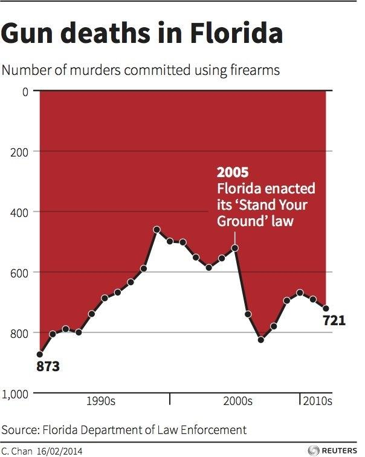
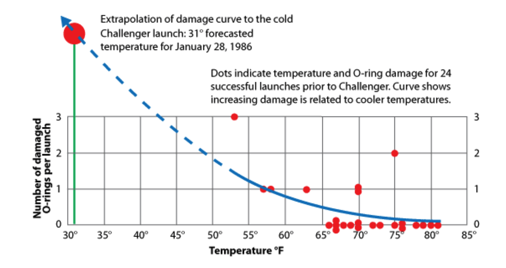

# Critiques
```{r setup, include=FALSE}
knitr::opts_chunk$set(echo = FALSE, warning=FALSE, message=FALSE)

library(tidyverse)
library(lubridate)
```

## Dual Y-Axes

In general, dual y-axes are hard to do correctly, and can be easily used
maliciously. Anytime I see a graph with dual y-axes I'm imediately suspicious.

[Lisa Charlotte Rost](https://blog.datawrapper.de/dualaxis/) has a great example
of how the arbitrary scaling of each axis results can result in unintentionally
confusing graphs.

In particular, the relative percent change or the rate of change is now messed
up because the slopes on the two axes are not equivalent. Malicious tweaking of
the scales would allow us to show whatever we want.

[Example.](https://badvisualisations.tumblr.com/image/186899740601) Market
share of a particular cookie manufacturer.


## Critique Workflow

1.  Identify the primary and secondary insights that the graphic is trying to 
    convey. 
2.  Identify the EPTs used and what is confusing or difficult to do.
3.  Identify how to use more effective EPTs for the primary and secondary
    insights. 
4.  Identify points of confusion and decide those could be addressed (e.g. an
    introduction graph or just better annotation)


## General Examples to Critique

1.  Attitudes to one night strands compared by gender and age group.
    
    a)  What are the primary comparisons intended? The secondary? Is this the order
        you would think?
    b)  What do you think about the texture?
    c)  What about this?
```{r, echo=FALSE}
data <- tribble(
    ~Gender, ~Age, ~`Always wrong`, ~`Mostly wrong`, ~`Sometimes wrong`, ~`Rarely wrong`, ~`Not wrong at all`,
    'Male',   '16-24',  16, 15, 35, 15, 19,
    'Female', '16-24',  29, 23, 31, 8, 9,
    'Male',   '25-34',  21, 14, 31, 12, 22,
    'Female', '25-34',  28, 16, 32, 9, 15,
    'Male',   '35-44',  28, 16, 29, 7, 20,
    'Female', '35-44',  33, 20, 26, 6, 15,
    'Male',   '45-54',  29, 23, 25, 6, 17,
    'Female', '45-54',  41, 25, 22, 4, 8,
    'Male',   '55-64', 36, 24, 22, 4, 14,
    'Female', '55-64', 52, 27, 15, 2, 4,
    'Male',   '65-74', 49, 23, 13, 5, 10,
    'Female', '65-74', 66, 23, 7, 1, 3) %>%
    pivot_longer(3:7, names_to = 'Response', values_to='Percent') %>%
    mutate(Response = factor(Response),
           Response = fct_inorder(Response),
           Age      = factor(Age),
           Age      = fct_inorder(Age),
           Age      = fct_rev(Age))

data %>%
    mutate(Age = fct_rev(Age)) %>%
    ggplot(aes(x=Gender, y=Percent, fill=Response)) +
    geom_col() +
    facet_grid(.~Age) +
    # scale_fill_gradient(low='red', high='green') +
    theme(legend.position = 'top')


data %>%
    mutate(Percent = ifelse(Gender=='Male', -Percent, Percent)) %>%
    ggplot(., aes(x=Age, y=Percent, fill=Response)) +
    geom_col( ) +
    geom_hline(yintercept=0, color='red') +
    # scale_fill_discrete( low='green', high='red') +
    coord_flip()
```
    
2.  The following graph received an extradinary amount of conversation.

   
   The reason is because the graph designer opted to use a negative y-axis because
   murders are a negative thing and the visual impression of dripping blood is
   very distinct.  However on first glance, a reader would assume that Florida
   gun deaths decreased after the *Stand Your Ground* law was enacted. 
   [Alberto Cairo](http://www.thefunctionalart.com/2014/04/in-visualization-baselines-and-negative.html) and
   [Robert Kosara](https://eagereyes.org/journalism/when-bars-point-down)
   both have nice discussions about this graph and a similar one about 
   deaths in Iraqi.
   
    There are two aspects that make this second chart work and the first to be
    misleading.
    a) The location of the x-axis. 
    b) Sub-graphics and annotations taking up the background space which clearly
        differentiate the foreground and background.
        
3. 90 Years of Gender Inequality in Canadian Politics (1930-2019). 
    a) Deputies are elected members of the House of Commons.
    b) Ministers are similar to the US Cabinet members. These are senior members of the ruling party and each Minister is also a House of Commons Deputy.
    c) <iframe width="560" height="315" src="https://www.youtube.com/embed/NFLNhMsbvw4" frameborder="0" allow="accelerometer; autoplay; encrypted-media; gyroscope; picture-in-picture" allowfullscreen></iframe>
    d) What do the dots represent? 
        i) A person, a seat? 
        ii) Why do the dots turn black and then fall out? Why do new dots show up?
    e) What could help this video? 
        i) Are dots the right choice? 
        ii) What about a pie chart over time?
        

3.  This 
    [New York Times](https://www.nytimes.com/interactive/2021/03/31/world/global-vaccine-supply-inequity.html)
    article on the discrepancy in Covid-19 vaccination rates between the rich
    and poor countries makes a subtle use of a log10 transformation on both the
    x and the y axes.

4.  Color gradients - Many different states use color coding to indicate a 
    level of risk. For Covid-19 those color scales have varied quite a lot from
    [state to state](https://www.nytimes.com/2021/04/02/style/coronavirus-safety-colors-states.html).
    a)  Green for low risk and Red for high risk is fairly common.
    b)  How many risk levels should there be? 3-4 is probably all we can handle.
    c)  Green -> Yellow -> Red is intuitive for this scale simply because of
        traffic lights.
    d)  But a number of states do other things:
        i) Oklahoma: Green -> Yellow -> Orange
        ii) Alabama : Green -> Yellow -> Orange -> Red
        iii) Colorado : Green -> Blue -> Yellow -> Orange -> Red -> Purple
        iv) North Dakota : Blue -> Green -> Orange -> Red -> Dark Red
        v) Utah : Different Shades of Blue!
        vi) New Mexico: Tuquoise -> Green -> Yellow -> Red
        
    
    
4. More Scrollytelling!  Again we are zooming out to a wider and wider perspective.
    a)  https://www.nytimes.com/interactive/2019/11/06/us/politics/elizabeth-warren-policies-taxes.html
    b)  The adding of dots is pretty cool and visually striking.
    c)  But comparison among the plans is challenging. By looking at *area* covered
        by the dots, we get a sense of this, but area is really far down on the EPT
        scale.
    d)  The graphs omit critical information that is in the text. For example
        Warren's plan for Medicare For All raises most of its funding by subverting
        corporation payroll that previously went to insurance payments. So much of
        yellow dots isn't new costs on employees or employers. 

5. Scrollytelling! The Gates Foundations 2019 Report.
    a)  https://www.gatesfoundation.org/goalkeepers/report/2019-report/#ExaminingInequality
    b)  Initial graphic sets the stage, and indirectly the order of discussion.
        Font sets the tone that this is not data, but rather an idealized visualization.
    c)  Scrollytelling is the zooming.
    d)  Annotation on demand!
    
6. Fonts indicating uncertainty (This is a pretty new idea!)
    a)  Washington Post [article](https://www.washingtonpost.com/graphics/politics/trifecta/)
    b)  Races that are considered competitive are circled in a handwriting font
        to indicate that the notion of "competitive" is subjective.
    c)  A [journal article](https://tobias.isenberg.cc/personal/papers/Wood_2012_SRI.pdf)
        about "sketchiness" as a visual attribute of a graph mark.
    d)  Do you think a gradient scale of sketchiness would work? Or is it a
        binary on/off stylistic choice?
    e)  Not widely available in graphing packages.

7. Other Methods for indicating variability
    a) Background distribution. 
        i) [Flowing Data - Time Spent](https://flowingdata.com/2016/12/06/how-people-like-you-spend-their-time/)
        ii) [Flowing Data - Firsts!](https://flowingdata.com/2017/02/23/the-first-time/)
    b) Error Bars / Error Ribbons
        i) [Supreme Court Justices](https://i.redd.it/tbkdkwgxgmy31.png)
        ii) [Donald Trumps Approval Rating](https://projects.fivethirtyeight.com/trump-approval-ratings/?ex_cid=rrpromo)
    c) Predictive 
        [hurricane tracks](https://www.nytimes.com/interactive/2019/08/29/opinion/hurricane-dorian-forecast-map.html) 
        are a classic issue of needing to display uncertainty.


## Historically Significant Graphs

### John Snow's Map of Cholera Outbreak
The 
[Germ Theory of Disease](https://en.wikipedia.org/wiki/Germ_theory_of_disease)
did not become the commonly accepted scientific consensus about disease
until the mid 1880's. Prior to that, 
[Miasma Theory](https://en.wikipedia.org/wiki/Miasma_theory)
that held that diseases—such as cholera, chlamydia, or the Black Death—were
caused by a miasma (μίασμα, Ancient Greek for "pollution"), a noxious fomr
of "bad air", also known as night air. The theory held that epidemics
were caused by miasma, emanating from rotting organic matter.
In London 1854, a cholera outbreak in SoHo neighborhood the physician 
[John Snow](https://en.wikipedia.org/wiki/John_Snow)
stopped a 
[cholera](https://blogs.cdc.gov/publichealthmatters/2017/03/a-legacy-of-disease-detectives/)) 
outbreak by keeping careful records of deaths by cholera and 
[mapped them](https://en.wikipedia.org/wiki/John_Snow#/media/File:Snow-cholera-map-1.jpg). 
The striking observation to be made from the map is that some houses
had many cases of cholera and others had very few (notice the near-by 
brewery). If cholera was being spread by noxious air, then we should
expect that people would be equally likely to be infected.
A break-through came in the form of a female cholera patient who had sent her
servant to fetch water from the water well in the SoHo neighborhood because
she preferred the taste. With the only common thread being the well,
John Snow removed the pump handle and the epidemic ground to a halt.
It would later be shown that this well was It would eventually turn out
that the well was contaminated by a old cesspit, only 3 feet away.

<iframe width="560" height="315" src="https://www.youtube.com/embed/TLpzHHbFrHY" frameborder="0" allow="accelerometer; autoplay; encrypted-media; gyroscope; picture-in-picture" allowfullscreen></iframe>

<iframe width="560" height="315" src="https://www.youtube.com/embed/1jlsyucUwpo" frameborder="0" allow="accelerometer; autoplay; encrypted-media; gyroscope; picture-in-picture" allowfullscreen></iframe>

### Florence Nightingale's Rose Plot
Florence Nightingale kept detailed records about deaths in a military
hospital during the Crimean War (1854) and believed that the conditions
of the hospital were partly to blame for the death of 4077 soldiers
(10 times more died from disease than from their wounds). Her 
[coxcomb graph](https://en.wikipedia.org/wiki/Florence_Nightingale#/media/File:Nightingale-mortality.jpg) 
helped show the change in mortality after a sanitation commission flushed
out the sewers and improved ventilation. Also in that same time, Nightingale
implemented hand washing and other hygiene practices to the hospital. 

She combined these and other graphics into a report to the UK Royal Commission
*Mortality of the British Army (1858)* clearly showing how many more
soldiers die due to lack of sanitary conditions. 
<iframe width="560" height="315" src="https://www.youtube.com/embed/VTdVPNvwULM" frameborder="0" allow="accelerometer; autoplay; encrypted-media; gyroscope; picture-in-picture" allowfullscreen></iframe>

<iframe width="560" height="315" src="https://www.youtube.com/embed/yhX0OR1_Vfc" frameborder="0" allow="accelerometer; autoplay; encrypted-media; gyroscope; picture-in-picture" allowfullscreen></iframe>

### Space Shuttle Challenger
The space shuttle *Challenger* exploded due to o-rings not sealing the
rocket boosters. Engineers working on the launch warned that due to the
cold weather predicted on launch day, there could be an issue. 

As NPR 
[reported](https://www.npr.org/sections/thetwo-way/2016/01/28/464744781/30-years-after-disaster-challenger-engineer-still-blames-himself)

>   The night before the launch, Bob Ebeling and four other engineers at NASA 
>   contractor Morton Thiokol had tried to stop the launch. Their managers and NASA
>   overruled them. That night, he told his wife, Darlene, "It's going to blow up."

It isn't clear exactly what got presented at that meeting, but subsequent investigations
revealed temperature information presented in a non-optimal format. 

The graph below gives information about each pair of rocket that had flown and 
if they had experienced O-ring failure as well as the temperature at which the
rocket pair had flown in.


This second graph gives the relationship between temperature and number of O-ring
failures but inextricably neglects to include the flights with zero failures.


The alternative visualization given below is much clearer and perhaps would
have resulted in a different decision.



A slightly longer description of these is available 
[here](http://aerossurance.com/safety-management/challenger-launch-decision-30/) 
and a full novel-length investigation
[here](https://read.amazon.com/kp/embed?asin=B014RWV2SK&preview=newtab&linkCode=kpe&ref_=cm_sw_r_kb_dp_2CDR54DG0ME9V0XC5YG6).


<iframe width="560" height="315" src="https://www.youtube.com/embed/Vl8LdwH_yng" frameborder="0" allowfullscreen></iframe>


## Awesome xkcd graphs
    a) [Movie Timelines](https://xkcd.com/657/)
    b) [Heatmaps that are just population density](https://xkcd.com/1138/)
    c) [Fukushima Radiation Dose Chart](https://xkcd.com/radiation/)
    d) [Money](https://xkcd.com/980/)
    e) [Flagstaff Temperature is Perfect](https://xkcd.com/1916/)
    f) [Congressional Makeup](https://xkcd.com/1127/)
    g) [Dumb Maps of "Most/Best XXXX in each state"](https://xkcd.com/1845/)


## Final Projects

1.  Pick a social data visualization challenge from any of the following: 
    *(the list order is in order of ease of finding visualization submissions and*
    *ease of data wrangling needed.)*
    a)  Reddit's 
        [/r/dataisbeautiful](https://www.reddit.com/search/?q=dataisbeautiful%20DataViz%20battle) 
        page had a monthly Data Viz competition 
        for about two years before the momentum died. 
        For each monthly challenge, submissions were posted on the monthy thread.
    b)  On Twitter, there is a #TidyTuesday project that has been running for
        4 years. The original datasets can be found in a 
        [GitHub](https://github.com/rfordatascience/tidytuesday) repository.
        The difficulty in using this is that to find submissions you have to
        search through Twitter posts. For example to find submissions on the
        Traumatic Brain Injury data set, I search Twitter for 
        "#TidyTuesday Traumatic Brain Injury TBI"  and found several submissions.
        The #TidyTuesday datasets might involve more data wrangling as the
        projects are intended to help people learn to do both data wrangling and
        visualization.
    c)  The website [Kaggle](https://www.kaggle.com) has a huge number of public
        data sets and individuals are free to submit an analysis. Often these
        take the form of data wrangling and a machine learning algorithm, but
        there is often some very insightful visualizations.
2.  Pick several submissions and do a critique of them. Pick at least one bad
    submission, two mediocre submissions that you can say both good and bad
    things about, at least one very good submission. 
3.  Create a comprehensive story, creating at least 3 graphics, that a reader
    would be able to follow. This info-graphic should be for mass consumption
    among adults, so pay attention to good annotation and labeling.
4.  Create a report in the same format as the first project that includes your 
    critiques and that describes your thinking in how you decided on the
    graphs you produced and the revision process you used to simplify and polish
    your final graphs.
