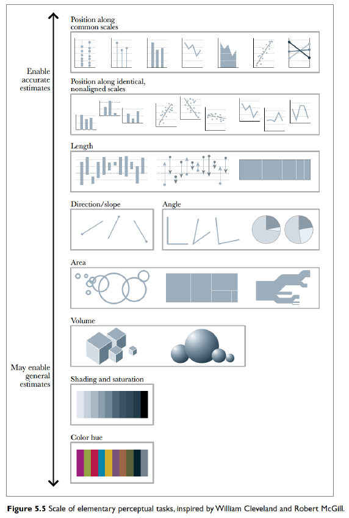

# Elementary Percepual Tasks

* Some Visual tasks are easier than others.

From Hadley Wickham's Stat 405 at Rice. (Slides 34 - 40)
[Effective Visualizations](http://stat405.had.co.nz/lectures/20-effective-vis.pdf)

## Groupings

The way we organize our graphics can lead a viewer to create mental groups of marks.

[Winona State's Data Visualization PowerPoint](https://github.com/WSU-DataScience/SDSS19-dataviz-workshop/blob/master/slides/Visualization%20theory%20and%20principles.pptx)

Slides 30-50

* Enclosures
* Connections
* Proximity
* Similarity (color/shape)

Example: Warpbreaks
While spinning wool into thread, if the tension on the wool isn't correctly set, the thread can break. Here we compare two different types of wool at three different tensions.

<!-- --><!-- --><!-- --><!-- -->

## "Color" Scales

Defining Color really has three different attributes (From [Wikipedia](https://en.wikipedia.org/wiki/HSL_and_HSV)).

### HSV Scale
* Hue: The attribute of a visual sensation according to which an area appears to be similar to one of the perceived colors: red, yellow, green, and blue, or to a combination of two of them.
* Saturation: The "colorfulness of a stimulus relative to its own brightness"
* Value: The "brightness relative to the brightness of a similarly illuminated white"

* Hue is appropriate for categorical variables.
* Saturation and/or Value is approriate for a quantitative variable scale.

Neither R nor Tableau make it particularly easy to map these aspects, so we won't get too deep into it.

