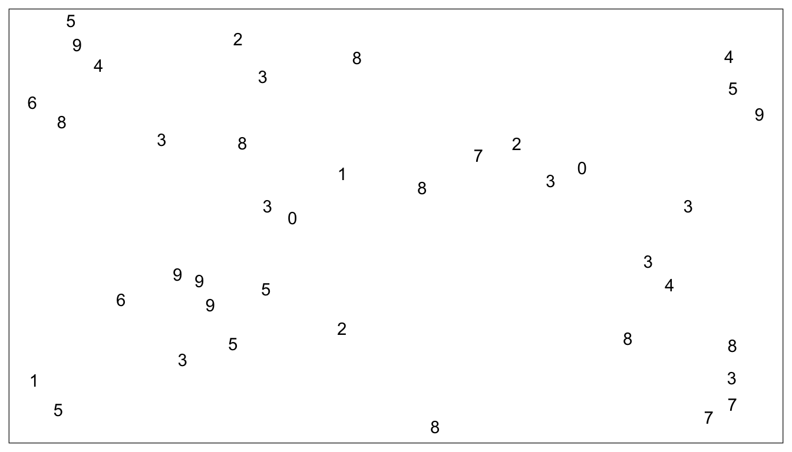
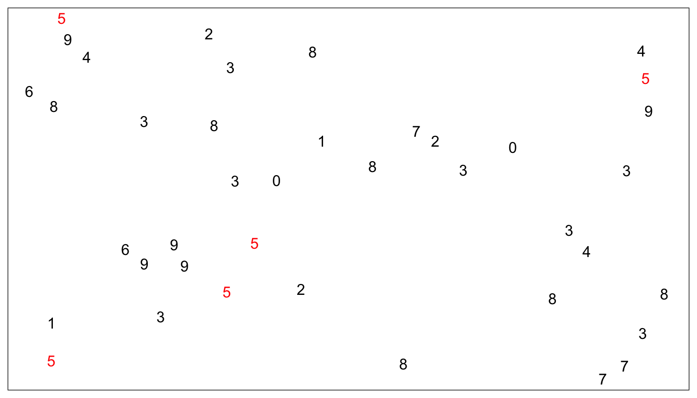
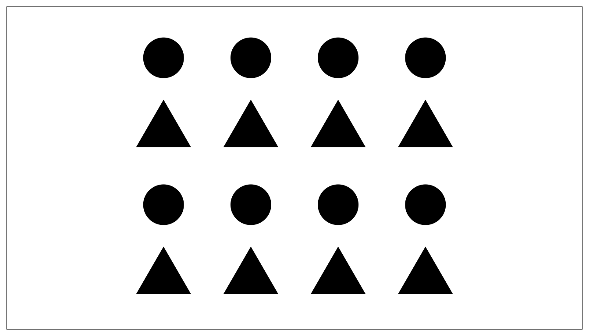
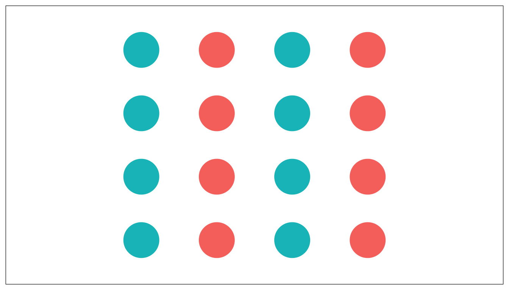
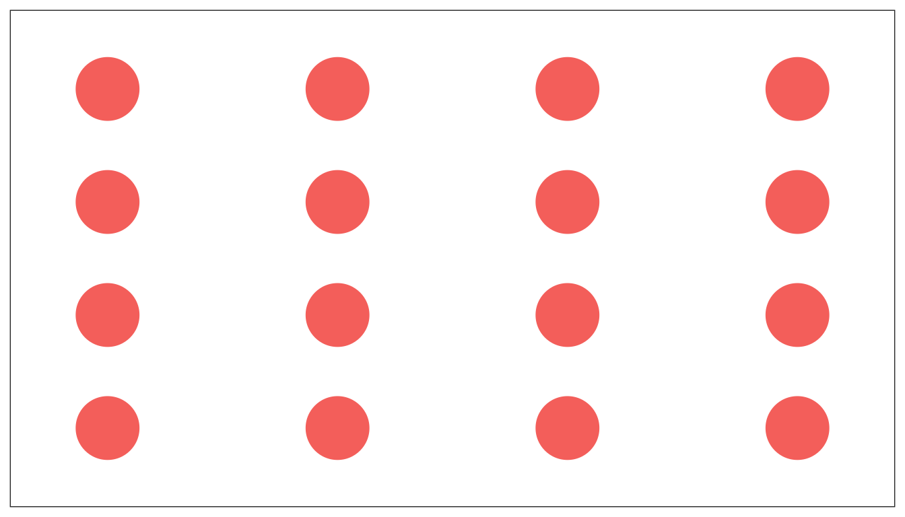
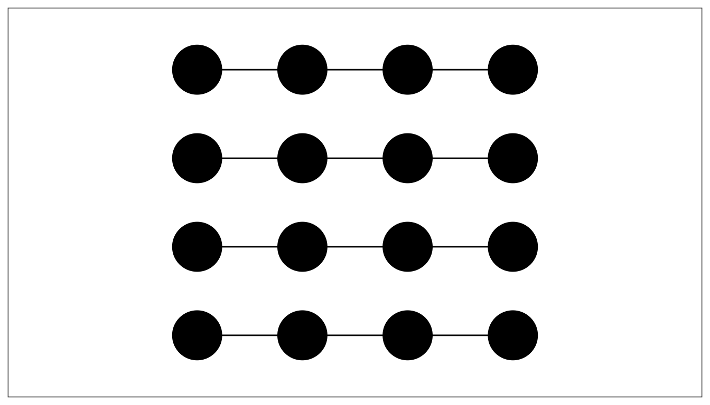
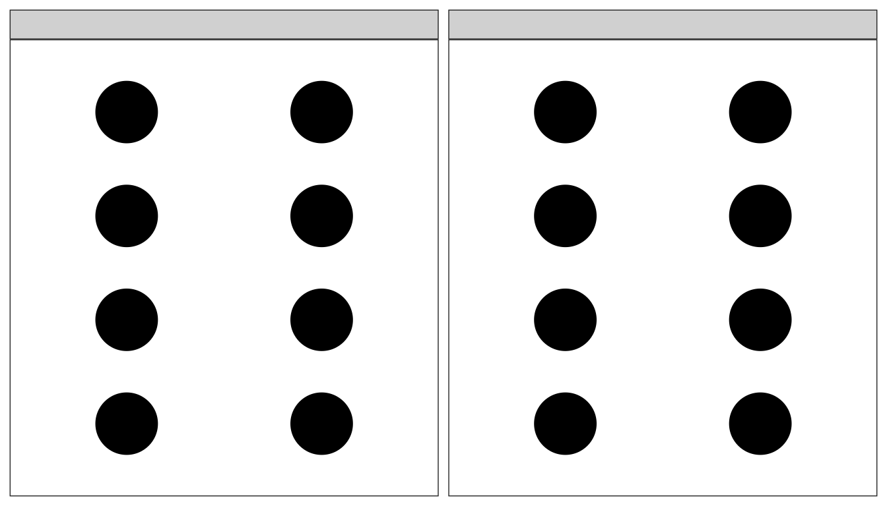
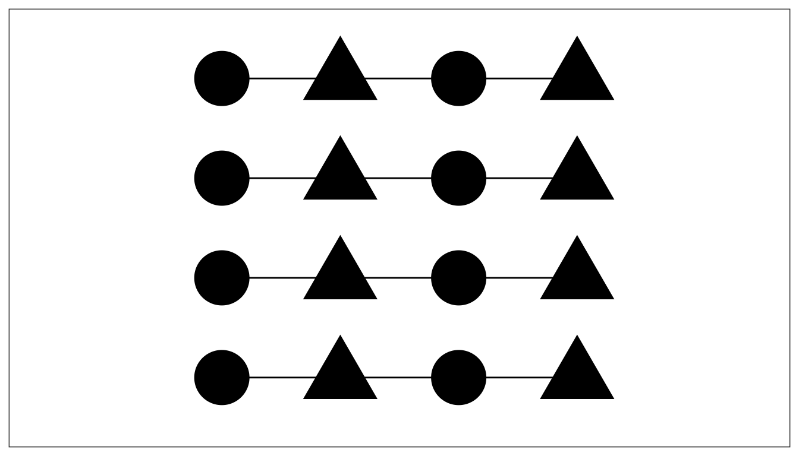
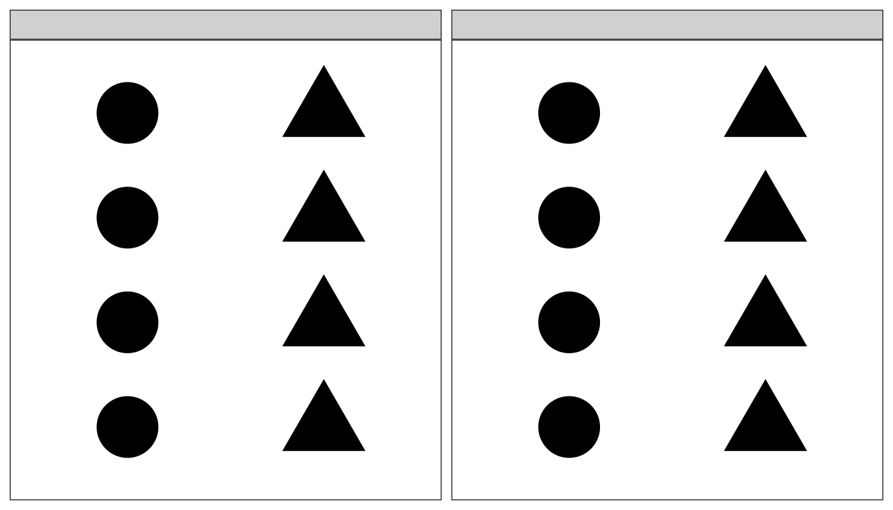
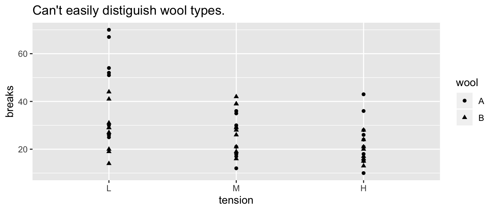

# Principles of Graphing

## Elementary Perception Tasks

* Some Visual tasks are easier than others because our visual processing evolved to do certain tasks.

## Groupings / Gestalt

The way we organize our graphics can lead a viewer to create mental groups of marks.

The way we form groupings can be in one of the following ways, (where higher grouping methods produce a stronger grouping effect.

* Enclosures
* Connections
* Proximity
* Similarity (color/shape)

In the following example, find all the fives:

If instead, we form a grouping by adding color, then the group of fives stands out prominently.

*This example was inspired by an example by Alberto Cairo.*

### Grouping Examples

In the following examples, ask yourself what the visual grouping the graph is encouraging? Are the rows or columns grouped? *These are taken from a presentation by Todd Iverson and Silas Bergen.*

Some grouping is stronger than others

### Example: Warpbreaks
While spinning wool into thread, if the tension on the wool isn't correctly set, the thread can break. Here we compare two different types of wool at three different tensions.

## "Color" Scales

Defining Color really has three different attributes (From [Wikipedia](https://en.wikipedia.org/wiki/HSL_and_HSV)).

#### HSV Scale
* Hue: The attribute of a visual sensation according to which an area appears to be similar to one of the perceived colors: red, yellow, green, and blue, or to a combination of two of them.
* Saturation: The "colorfulness of a stimulus relative to its own brightness"
* Value: The "brightness relative to the brightness of a similarly illuminated white"

* Hue is appropriate for categorical variables.
* Saturation and/or Value is appropriate for a quantitative variable scale.

Neither R nor Tableau make it particularly easy to map these aspects, so we won't get too deep into it.

1. In soccer, Kylian Mbappé is being referred to as the next world dominating player. The graphic below compares Mbappé to soccer greats Cristiano Ronaldo and Lionel Messi. Below is a graph showing the number of goals scored during various parts of their career (first 100 professional games, second 100, etc). 

    
    a. Identify the EPT the reader is required to perform and the grouping structures used.
    b. Comment on how the grouping was effective or if you think some change might be better.
    
2. In NBA basketball, shot accuracy and distance from the net is important. In the following graph, we can investigate how often shots are taken from different distances.

    
    a. Identify the EPT the reader is required to perform and the grouping structures used.
    b. Comment on how the grouping was effective or if you think some change might be better.
    
3. The following graphic calculates difference between a month's temperature compared to the monthly average temperature across the years since 1850. (i.e. Compare the average January 2014 temperature to the average January temperature across the last 170 Januaries.)

    
    a. Identify the EPT the reader is required to perform and the grouping structures used.
    b. Comment on how the grouping was effective or if you think some change might be better.
    
