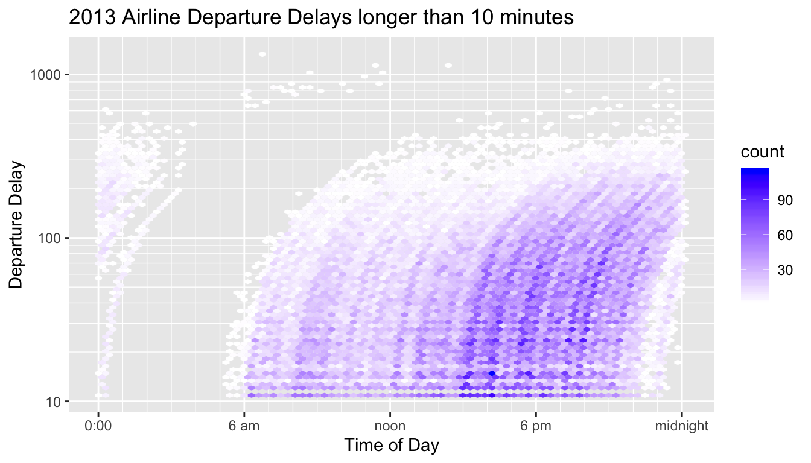

# Week 4

## Visualizing 2 or more Continuous variables

### Scatter plots
Basic idea is to build off of a scatter plot. This visualizes the relationship between two continuous variables.

In a scatter plot we can see the relationship between two variables. We can see the relationship among more variables (either continuous or discrete) by adding Size, Color, and Shape.

We could also add other categorical variables by adding faceting. With this combination we can visualize the relationship between up to 6 different variables.

### Pairs plots (All-vs-all scatterplots)

### Correlation Plots
## Pearson's Correlation Coefficient

We first consider Pearson's correlation coefficient, which is a statistics that measures the strength of the linear relationship between the predictor and response. Consider the following Pearson's correlation statistic
$$r=\frac{\sum_{i=1}^{n}\left(\frac{x_{i}-\bar{x}}{s_{x}}\right)\left(\frac{y_{i}-\bar{y}}{s_{y}}\right)}{n-1}$$
where $x_{i}$ and $y_{i}$ are the x and y coordinate of the $i$th observation. Notice that each parenthesis value is the standardized value of each observation. If the x-value is big (greater than $\bar{x}$) and the y-value is large (greater than $\bar{y}$), then after multiplication, the result is positive. Likewise if the x-value is small and the y-value is small, both standardized values are negative and therefore after multiplication the result is positive. If a large x-value is paired with a small y-value, then the first value is positive, but the second is negative and so the multiplication result is negative.

The following are true about Pearson's correlation coefficient:

1. $r$ is unit-less because we have standardized the $x$ and $y$ values.
2. $-1\le r\le1$ because of the scaling by $n-1$
3. A negative $r$ denotes a negative relationship between $x$ and $y$, while a positive value of $r$ represents a positive relationship.
4. $r$ measures the strength of the *linear* relationship between the predictor and response.

## Overplotting

### Transparency

### Intensity Maps

---------------------------------
   delay       n      proportion 
----------- -------- ------------
  (-30,0]    200085     0.6091   

  (0,30]     80141      0.2439   

  (30,60]    21710     0.06608   

 (60,120]    16858     0.05132   

 (120,180]    5830     0.01775   

 (180,Inf]    3893     0.01185   
---------------------------------

This graph leads me to think that MOST flights are quite late, when if fact, they aren't. This is due to the problem of "proportional pixels". There is so much space and color devoted to flights that are more than 30 minutes late that the viewer can't help but have that impression.

### Contour Plots

## Exercises

1. Read Chapters 12 and 18 from Wilke's book. Feel free to skip section 12.3.

2. We will use a smaller version of the diamonds dataset that Wilke uses in his Chapter 18. You can download it from my GitHub site in in [.csv file](). We will examine price, carats, cut (Fair, Good, Very Good, Premium, and Ideal), color (J - D), and clarity (I1, SI2, SI1, VS2, VS1, VVS2, VVS1, IF), where the category labels I've given are from worst to best. 
    a) Had I not told you that clarity level IF is the best clarity, what graphs could you make to figure that out? Create and show a graph that demonstrates this and explain your graph. 
    b) If the diamond clarity isn't good, the dimond cutter won't worry too much about the quality of cut. Make a graph that demonstrates that and explain your reasoning.
    c) While in principle it is possible for the dimond carats to be any number, they are often cut to be some common carat size. Create a visualization that shows this and discuss how the carat size changes as the cut and clarity improve.
    
3.     

