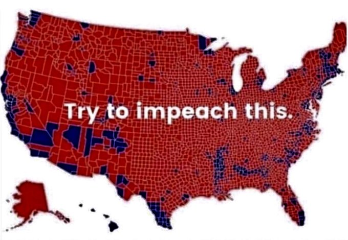
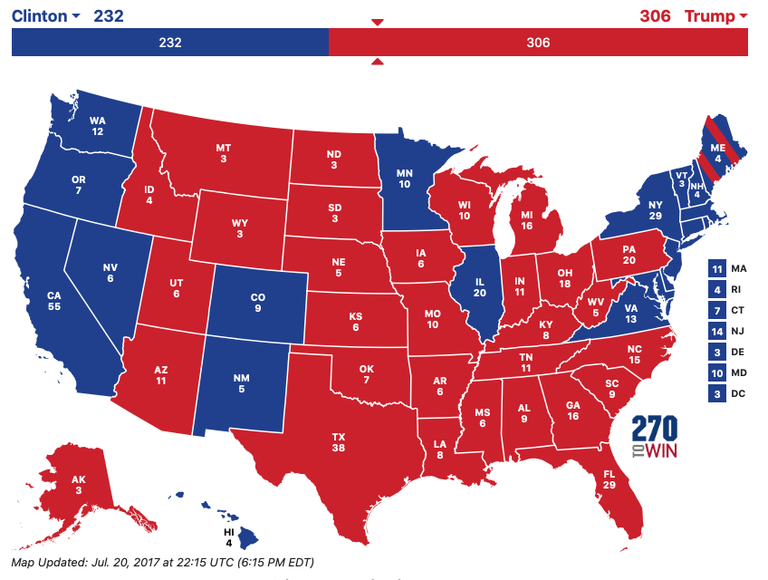
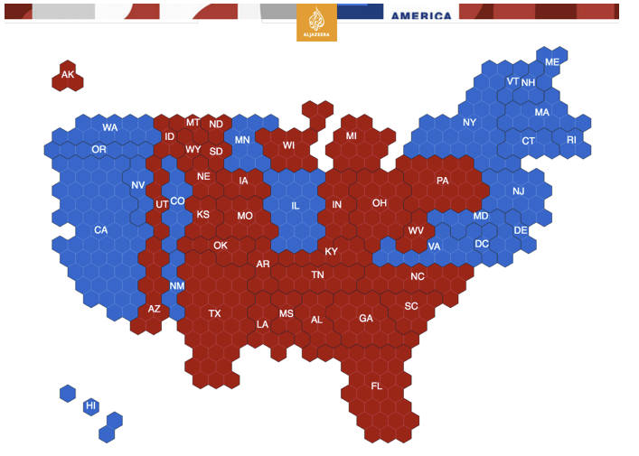
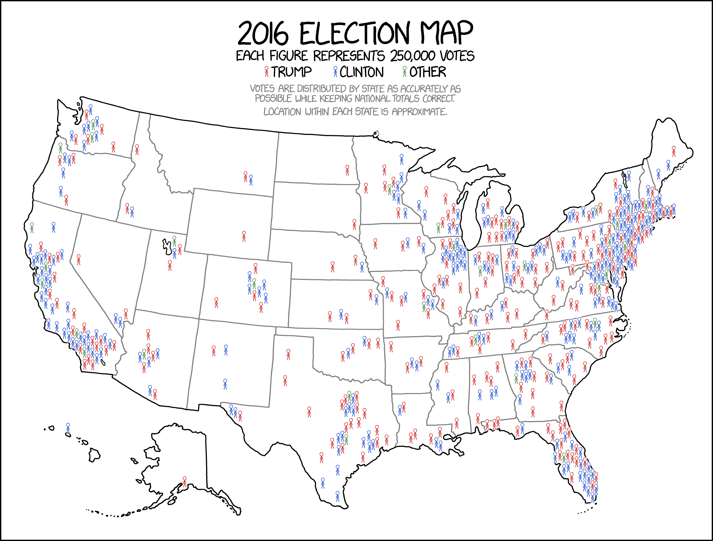

# Geographic

## Projections 
The usual map of the world that is shown is highly misleading. Because we have to project a spherical object onto a 2-D plane, we can't do it without distorting the areas. The result is that areas near the north and south poles look much larger than they actually are. This ends up emphasizing high latitude European countries compared to equatorial countries.

[The True Size](https://thetruesize.com)

Here are the three most commonly used projections:
Equirectangular has an even grid of latitude and logitude lines.

The Robinson projection is a compromise that tries to re-scale land near the poles to be closer to the actual size.

Another compromise is to allow for discontinuities on the map surface. This decreases the amount of distortion, but cleaves Greenland and Antarctica.

I haven't had an opportunity to place my own spin on geographic maps and instead we will look at Claus Wilke's Chapter on [Geographic maps](https://serialmentor.com/dataviz/geospatial-data.html).

<!--html_preserve-->

<!--/html_preserve-->

One of the best things about interactive maps is that you can zoom in and out and change the level of resolution. The ability to easily transition between different scale is amazing and is a hallmark of a quality interactive experience.

Google Maps is built on a 256x256 pixel tile system where zoom level 0 is an image of the whole earth. Each zoom step in halves the X and Y range and so shows 1/4 of the surface area. Zoom level 20 is the scale of a single building, level 14 is the zoom level displayed above. 

## Map Layers
Most maps that are viewed have multiple sources and types of data displayed. In most software that specifically handles maps, we have the option of adding multiple data types to build up a custom map.

From a blank map, we could:

1. Add a layer showing ocean/landmass divisions.
2. Add a layer showing country borders.
3. Add a layer showing state/province borders within countries.
4. Add a layer showing land type (forest, etc)
5. Add a layer showing major cities.
6. Add a layer showing major roads.
7. Add a layer showing major water-ways.

Fortunately there are many map creation sites that easily allow you to specify a location via the latitude and longitude coordinates and will display maps with the above layers already added.

## Chloropleths

A very common type of map is to shade geographic regions based on some variable. These are quite basic. 

The problem with chloropleths is that the amount of pixels devoted to a region is proportional to the geographic size. By shading in the entire state, large states (by area) input more weight.  

A great example of the using area US county area as a proxy for population was given by Donald Trump.

The counties filled red represent counties in which a majority of voters selected Trump. Aside from a couple of counties that are mislabeled, the large percentage of pixels colored red seems to indicate that a vast majority of the country voted for Trump. 

However, the counties don't matter. In the US, the electoral college is what matters and most states contribute their entire set of electoral college votes to whichever candidate gets the most votes. So, despite most counties in Colorado having a majority of votes for Trump, the most populous counties, Denver, Jefferson, Arapahoe, Larimer, Adams, Boulder, went Democratic except for El Paso county which contains Colorado Springs. As a result, Colorado as a whole voted democratic.

But this still doesn't fix the area problem because Montana is still a gigantic red state with only three electoral votes.  Instead we could re-size the states according to their electoral college number of votes. In the 2012 election, the website 538 created a remarkably good map using hexagons to represent states. Inspired by 538, other news sites utilized a similar map in 2016. Below is a map created by Al Jazeera.

This keeps the approximate location of each state and re-scales it to be approximately proportional to the population, with the usual electoral college weirdness. 

But perhaps the best version of the 2016 vote, came from the webcomic XKCD.

While it isn't clear that Minnesota voted democratic, it does keep the states in their familiar locations and shapes without devoting inappropriate numbers of red or blue pixels to states with large or small geographical areas.

## Chloropleths in Tableau
The mapping within Tableau is unfortunately limited. We can't easily create map layers and overlay them, but Tableau does a *great* job at taking data sets with a small amount of geographical information (e.g. country names, state/provinces, or even county names) and recognizing them as geographical data and making maps that show those and easily filling in the geo-political region.

<iframe width="560" height="315" src="https://www.youtube.com/embed/qLlAmqwg6wU" frameborder="0" allowfullscreen></iframe>

## Exercises

1. From the `data-raw` directory for this textbook, download the [Gun Ownership and Deaths in 2010](https://raw.githubusercontent.com/dereksonderegger/141/master/data-raw/Guns_%26_Suicide/Guns_State_Deaths_2010.csv) data. Create a chloropleth map of the US with each state colored by their gun ownership percentage.

2. From the `data-raw` directory for this textbook, download the [Arizona County Populations by Hispanic origin](https://raw.githubusercontent.com/dereksonderegger/141/master/data-raw/USA_Hisp/AZ_County_Populations_by_Hisp.csv) data. This data was downloaded from the US Census Bureau and includes estimates of population sizes sizes of both the hispanic and non-hispanic populations in each county.
    a) Notice that we have a pair of observations for each year. Remove all of the rows except for the 2018 data. Decide if you want to graph the percent hispanic or the percent non-hispanic in each county. Remove all the rows corresponding to whichever you don't want to graph. After the two filter steps, you should have just 15 rows of data.
    b) Create a chloropleth map of Arizona that shows the percent hispanic (or non-hispanic) for each county.
    

