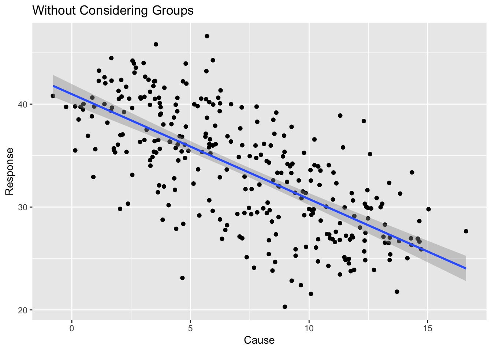
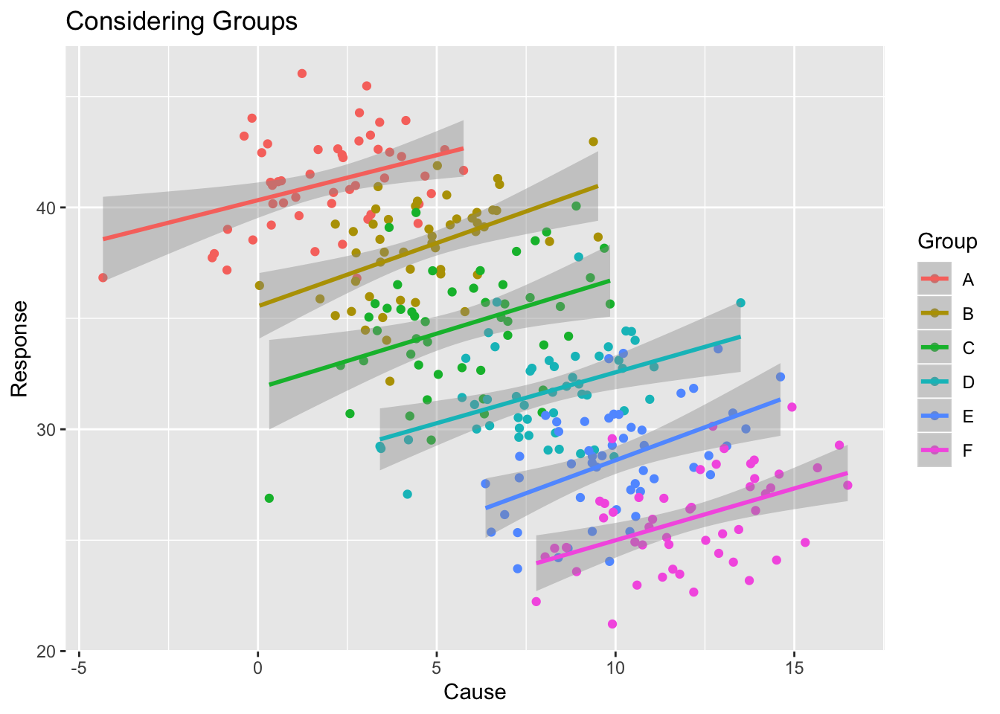

# Thinking Conditionally

There are many examples where the choice of grouping matters when looking at data sets.  In particular, Simpson's Paradox is a situation where the result changes based on what scale we examine the data.

## Simple Examples

### Gender Bias in Admission Rates.

In 1975, researchers looked into alegations of gender bias in graduate program admissions at University of California, Berkeley. Data from 1973 admissions showed a statistically signficant difference between acceptance rates between males and females.

| Gender   |   Applicants    |  Percent Admitted |
|:--------:|:---------------:|:-----------------:|
| Males    |  8442           | 44%               |
| Females  |  4321           | 35%               |

This appears to be pretty convincing evidence that females are being discriminated against.  However... when we look closer at the data we should look at the department level admission rates.

| Gender   | Department |   Applicants    |  Percent Admitted |  Which is Higher? |
|:--------:|:----------:|:---------------:|:------------------|:------------:|
| Males   | A	| 825	| 62%	|   |
| Females | A | 108	| 82% | F |
| Males   | B	| 560	| 63%	|   |
| Females | B | 25	| 68% | F |
| Males   | C	| 325	| 37%	| M |
| Females | C | 593	| 34% |   |
| Males   | D	| 417	| 33%	|   | 
| Females | D | 375	| 35% | F |
| Males   | E	| 191	| 28%	| M |
| Females | E | 393	| 24% |   |
| Males   | F	| 373	| 6%	|   |
| Females | F | 341	| 7%  | F |

We first notice that males and females tended to apply to different programs. For example 88% of department A applicants were male. Because females tended to apply to departments with lower acceptance rates, they had a lower university wide acceptance rate. However, in most departments (6/8) they actually were accepted at a higher rate than males.

### Kidney Stone Treatment

Suppose that we have two different treatments to address Kidney Stones. 

| Treatment | Patients   | Success Percent |
|:---------:|:----------:|:--------------:|
|  A        |  273/350   |   78%          |	
|  B        |  289/350   |   83%          |

So it appears that treatment B is a superior treatment. But behind the scenes we have the issue that kidney stones come in different sizes and treatment A is commonly used to treat small stones, and treatment B is commonly used to treat large stones.

| Treatment |  Size      | Patients  | Success Percent |
|:---------:|:----------:|:---------:|:---------------:|
|  A        | Small      |  81/87    |   93%           |	
|  B        | Small      | 234/270   |   87%           |
|  A        | Large      | 192/263   |   73%           |	
|  B        | Large      |  55/80    |   69%           |

So treatment A is is the superior treatment in *both* the small and large kidney stone cases.  But because treatment A is actually more expensive, it is more commonly used in the large stone case.

Without considering groups, there is a negative relationship between the cause/response, but when we consider the groups, there is a positive relationship.

### Build your own 

Simpson's paradox appears in a variety of situations. Come up with a scenario where the statistic changes interpretation based on the scale.

  1. Suppose that we look at patient fatalities between two surgeons. One surgeon is pretty average, while the other gets assigned the most dangerous and sever cases.
  2. Consider two baseball players where one players batting percentage is higher each year, but overall is lower.
  
  
### In Practice

When doing exploratory data analysis, we often find ourselves examining the relationship between two variables and seeing something interesting. The follow-up questions to ask yourself are:

  1. Does the relationship change for different genders?
  2. Does the relationship change for different socio/economic groups?
  3. Does the relationship change across time?
  4. Does the relationship change across space?
  5. Does the relationship change across **some grouping structure**?
  
### Corona Virus Example
In Spring of 2020, the corona virus is causing considerable worldwide problems and is widely spread. We are interested in how this disease has spread across the globe and could potentially affect us (at Northern Arizona University) as of March 10th.

Fortunately Johns Hopkins University has done the hard work of compiling case information from a variety of world and national resources and provided the aggregated data via a publicly accessible GitHub site. All the following graphs and discussion are based on their data and subject to Johns Hopkins license that their work shouldn't be used commercially.

